DE analysis Aflatoxin Degradation
================
2026-06-26

Used this code to make an OrgDB for Aspergillus flavus NRRL3226. Only
need to run once but downloads a lot of data and takes awhile.

``` r
#for making the orgdb
#options(timeout = 100000)
#makeOrgPackageFromNCBI(
#  version="1.2",
#  maintainer="Allie Byrne <allison.byrne@usda.gov>",
#  author="Allie Byrne <allison.byrne@usda.gov>",
#  outputDir="C:/Users/Allison.Byrne/Documents/Transcriptomics_data/redo_orgdb",
#  NCBIFilesDir="C:/Users/Allison.Byrne/Documents/Transcriptomics_data/redo_orgdb",
# tax_id=332952,
#  genus="Aspergillus",
#  species="flavus",
#  rebuildCache = T
#)

#then install the package
#install.packages("C:/Users/Allison.Byrne/Documents/Transcriptomics_data/redo_orgdb/org.Aflavus.eg.db", type = "source", repos=NULL)
```

I cleaned the reads with cutadapt and aligned with STAR using the
–quantMode GeneCounts command to get a table to reads per gene. Then I
selected out the fourth column from the output for each sample.

Now let’s split the Mn and no-Mn experiments because of the huge
difference in GE between the two.

``` r
sampletable_all <- read.table("sample_sheet_all_combined.txt", header=T)
rownames(sampletable_all) <- sampletable_all$SampleName
sampletable_all$Time <- as.factor(sampletable_all$Time)

head(sampletable_all)
```

    ##                    SampleName                 FileName Time AFB1 Experiment
    ## 11-1A-HAND_S7   11-1A-HAND_S7  11-1A-HAND_S7_deseq.tab    7   no          A
    ## 11-2A-HAND_S8   11-2A-HAND_S8  11-2A-HAND_S8_deseq.tab    7   no          A
    ## 11-3A-HAND_S9   11-3A-HAND_S9  11-3A-HAND_S9_deseq.tab    7   no          A
    ## 12-1A-HAND_S10 12-1A-HAND_S10 12-1A-HAND_S10_deseq.tab    7  yes          A
    ## 12-2A-HAND_S11 12-2A-HAND_S11 12-2A-HAND_S11_deseq.tab    7  yes          A
    ## 12-3A-HAND_S12 12-3A-HAND_S12 12-3A-HAND_S12_deseq.tab    7  yes          A
    ##                Micronutrients
    ## 11-1A-HAND_S7              no
    ## 11-2A-HAND_S8              no
    ## 11-3A-HAND_S9              no
    ## 12-1A-HAND_S10             no
    ## 12-2A-HAND_S11             no
    ## 12-3A-HAND_S12             no

``` r
#now eliminate one weird sample:

sampletable_all <- sampletable_all[which(sampletable_all$SampleName!="ExpD_8-1B_S4"),]

#and another weird sample
sampletable_all <- sampletable_all[which(sampletable_all$SampleName!="ExpE_8-1B_S16"),]

#subset to days 
sampletable_all_day4 <- sampletable_all[which(sampletable_all$Time==4),]

sampletable_all_day7 <- sampletable_all[which(sampletable_all$Time==7),]

#now subset to days and mn
sampletable_mnonly_day4 <- sampletable_all_day4[which(sampletable_all_day4$Micronutrients=="yes"),]

sampletable_nomn_day4 <- sampletable_all_day4[which(sampletable_all_day4$Micronutrients=="no"),]

sampletable_mnonly_day7 <- sampletable_all_day7[which(sampletable_all_day7$Micronutrients=="yes"),]

sampletable_nomn_day7 <- sampletable_all_day7[which(sampletable_all_day7$Micronutrients=="no"),]
```

Now let’s run the DE analysis

``` r
#read in as data 
se_star_mnonly_day4 <- DESeqDataSetFromHTSeqCount(sampleTable = sampletable_mnonly_day4,
                        directory = "./deseq2/all_combined",
                        design = ~ Experiment + AFB1)
```

    ## Warning in DESeqDataSet(se, design = design, ignoreRank): some variables in
    ## design formula are characters, converting to factors

``` r
#filter data
nrow(se_star_mnonly_day4)
```

    ## [1] 13136

``` r
#13136

se_star_mnonly_day4 <- se_star_mnonly_day4[rowSums(counts(se_star_mnonly_day4)) > 10, ]

#check filter
nrow(se_star_mnonly_day4)
```

    ## [1] 12424

``` r
#12424

#run the model and normalize counts
se_star_model_mnonly_day4 <- DESeq(se_star_mnonly_day4)
```

    ## estimating size factors

    ## estimating dispersions

    ## gene-wise dispersion estimates

    ## mean-dispersion relationship

    ## final dispersion estimates

    ## fitting model and testing

``` r
#normalize
norm_counts_mnonly_day4 <- log2(counts(se_star_model_mnonly_day4, normalized = TRUE)+1)

#visualization
vsd_mnonly_day4 <- vst(se_star_model_mnonly_day4)
sampleDistMatrix_mnonly_day4 <- as.matrix(dist(t(assay(vsd_mnonly_day4))))

#FIGURE 2 top left
#heatmap
pheatmap(sampleDistMatrix_mnonly_day4, clustering_method="ward.D2")
```

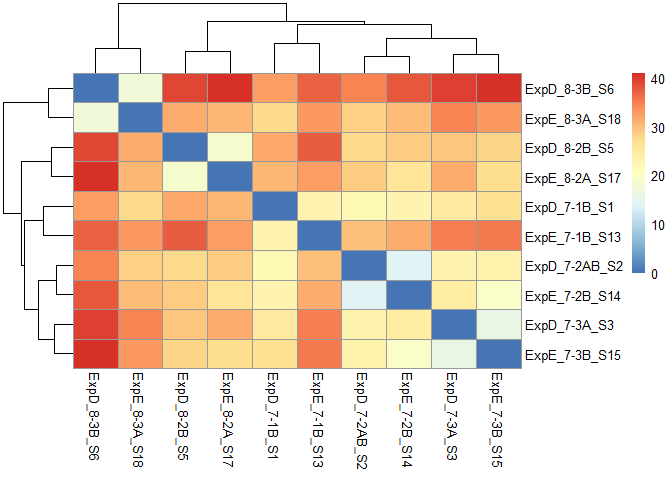<!-- -->

``` r
#pca
p_mn4 <- plotPCA(object=vsd_mnonly_day4, intgroup= "AFB1")
```

    ## using ntop=500 top features by variance

``` r
#FIGURE 2 bottom left
p_mn4 + theme_bw() + geom_point(size=5)
```

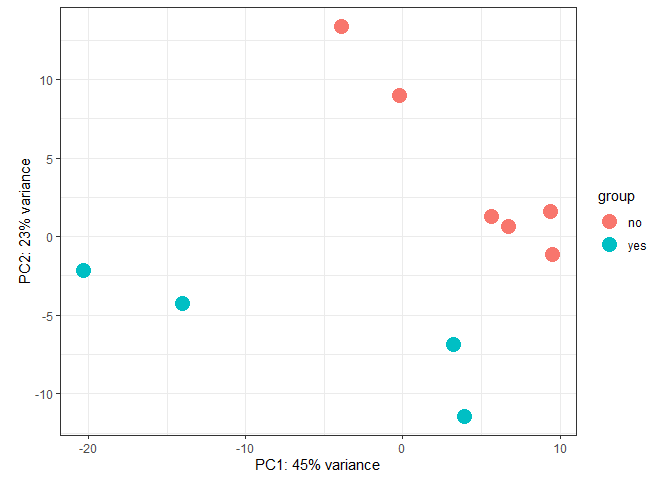<!-- -->

``` r
#check results
de_mnonly_day4 <- results(object = se_star_model_mnonly_day4, name="AFB1_yes_vs_no")

#shrink
de_shrinkmnonly_day4 <- lfcShrink(dds = se_star_model_mnonly_day4,
                 coef="AFB1_yes_vs_no",
         type="apeglm")
```

    ## using 'apeglm' for LFC shrinkage. If used in published research, please cite:
    ##     Zhu, A., Ibrahim, J.G., Love, M.I. (2018) Heavy-tailed prior distributions for
    ##     sequence count data: removing the noise and preserving large differences.
    ##     Bioinformatics. https://doi.org/10.1093/bioinformatics/bty895

``` r
#for volcano plot


# Example: using your shrunken results
df <- as.data.frame(de_shrinkmnonly_day4)

# Add significance categories
df <- df %>%
  mutate(
    neglogp = -log10(padj),
    sig = case_when(
      padj < 0.05 & log2FoldChange > 1  ~ "Up",
      padj < 0.05 & log2FoldChange < -1 ~ "Down",
      TRUE                              ~ "NS"
    )
  )
#FIGURE 2 TOP RIGHT
# Basic volcano plot
ggplot(df, aes(x = log2FoldChange, y = neglogp)) +
  geom_point(aes(color = sig), alpha = 0.7, size = 2) +
  scale_color_manual(
    values = c("Up" = "#D55E00", "Down" = "#0072B2", "NS" = "grey70")
  ) +
  geom_vline(xintercept = c(-1, 1), linetype = "dashed", color = "grey40") +
  geom_hline(yintercept = -log10(0.05), linetype = "dashed", color = "grey40") +
  labs(
    x = "Log2 Fold Change (shrunken)",
    y = "-log10(adjusted p-value)",
    color = "Direction",
    title = "Volcano Plot: AFB1 yes vs no (Mn+ Day 4)"
  ) +
  theme_bw(base_size = 14) +
  theme(
    plot.title = element_text(hjust = 0.5),
    legend.position = "right"
  )
```

    ## Warning: Removed 734 rows containing missing values or values outside the scale range
    ## (`geom_point()`).

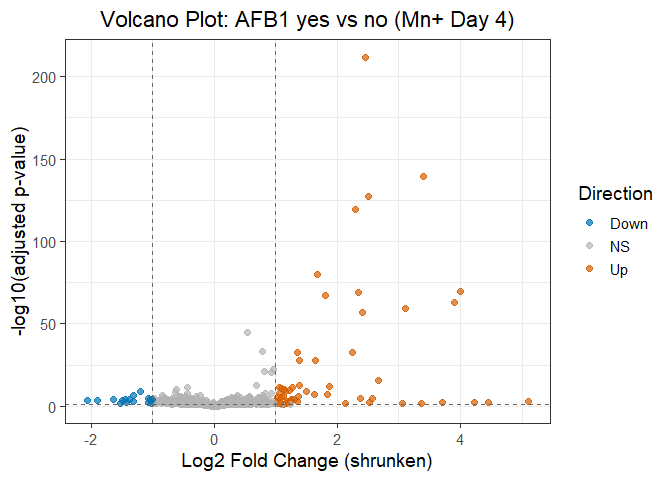<!-- -->

``` r
#add in gene labels
top_genes <- df %>%
  filter(padj < 0.05) %>%
  arrange(padj) %>%
  slice(1:4)

ggplot(df, aes(x = log2FoldChange, y = neglogp)) +
  geom_point(aes(color = sig), alpha = 0.7, size = 2) +
  geom_text_repel(
    data = top_genes,
    aes(label = rownames(top_genes)),
    size = 3,
    max.overlaps = Inf
  ) +
  scale_color_manual(
    values = c("Up" = "#D55E00", "Down" = "#0072B2", "NS" = "grey70")
  ) +
  geom_vline(xintercept = c(-1, 1), linetype = "dashed", color = "grey40") +
  geom_hline(yintercept = -log10(0.05), linetype = "dashed", color = "grey40") +
  theme_bw(base_size = 14)
```

    ## Warning: Removed 734 rows containing missing values or values outside the scale range
    ## (`geom_point()`).

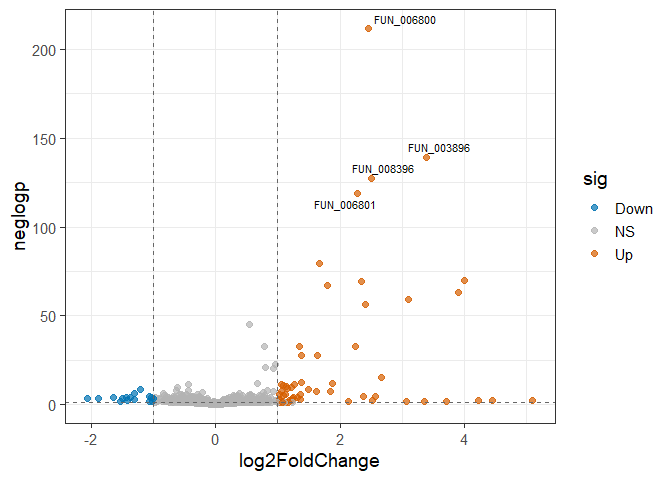<!-- -->

``` r
# check first rows of both results
head(de_mnonly_day4)
```

    ## log2 fold change (MLE): AFB1 yes vs no 
    ## Wald test p-value: AFB1 yes vs no 
    ## DataFrame with 6 rows and 6 columns
    ##              baseMean log2FoldChange     lfcSE      stat    pvalue      padj
    ##             <numeric>      <numeric> <numeric> <numeric> <numeric> <numeric>
    ## FUN_000001 1860.29121       0.902353  0.400419  2.253525 0.0242261  0.200002
    ## FUN_000002   17.93373       0.771924  0.496258  1.555489 0.1198296  0.476952
    ## FUN_000003   22.17016       0.237367  0.580619  0.408818 0.6826733  0.923241
    ## FUN_000005 1553.63152       0.468972  0.486136  0.964693 0.3346987  0.742634
    ## FUN_000006    3.12998       1.266214  0.922639  1.372383 0.1699442        NA
    ## FUN_000008   70.57914      -0.375487  0.388740 -0.965908 0.3340904  0.742555

``` r
head(de_shrinkmnonly_day4)
```

    ## log2 fold change (MAP): AFB1 yes vs no 
    ## Wald test p-value: AFB1 yes vs no 
    ## DataFrame with 6 rows and 5 columns
    ##              baseMean log2FoldChange     lfcSE    pvalue      padj
    ##             <numeric>      <numeric> <numeric> <numeric> <numeric>
    ## FUN_000001 1860.29121     0.03886748 0.0918763 0.0242261  0.200002
    ## FUN_000002   17.93373     0.02016455 0.0817801 0.1198296  0.476952
    ## FUN_000003   22.17016     0.00436230 0.0784606 0.6826733  0.923241
    ## FUN_000005 1553.63152     0.01248933 0.0793832 0.3346987  0.742634
    ## FUN_000006    3.12998     0.00908438 0.0795031 0.1699442        NA
    ## FUN_000008   70.57914    -0.01461420 0.0794557 0.3340904  0.742555

``` r
#write.table(de_shrinkmnonly_day4, "deseq2_shrink_results_redowithbatch_trimsamples_mnonly_day4_combined.txt", quote=F, col.names=T, row.names=T, sep="\t")
```

Now let’s analyze the gene list for GO overrepresentation and GSEA

``` r
#add seqID col
#using the shrunken data for the GO analysis
de_shrinkmnonly_day4_forGO <- as_tibble(de_shrinkmnonly_day4)
de_shrinkmnonly_day4_forGO$seqID <- rownames(de_shrinkmnonly_day4)

#join for aflavus GENEIDs
#read in table matching AF36 genes to gene IDs
Aflavus_geneIDs <- read.csv(file="af36_gene_ids.csv")

#rename so IDs match
colnames(Aflavus_geneIDs)[1] <- "seqID"
de_shrink4_rename <- mutate(as_tibble(de_shrinkmnonly_day4), seqID = rownames(de_shrinkmnonly_day4))

#join
DandE_ids <- left_join(de_shrinkmnonly_day4_forGO,Aflavus_geneIDs, by="seqID")

#add in gene names from NCBI
get_ncbi_description <- function(ids) {
  out <- lapply(ids, function(x) {
    s <- tryCatch(entrez_summary(db="gene", id=x), error=function(e) NULL)
    if (is.null(s)) {
      return(data.frame(
        geneid = x,
        name = NA,
        description = NA,
        stringsAsFactors = FALSE
      ))
    } else {
      return(data.frame(
        geneid = x,
        name = s$name,
        description = s$description,
        stringsAsFactors = FALSE
      ))
    }
  })
  do.call(rbind, out)
}

# Example usage:
onlymnday4 <- read_table(file="deseq2_shrink_results_redowithbatch_trimsamples_mnonly_day7_combined.txt")
```

    ## 
    ## ── Column specification ────────────────────────────────────────────────────────
    ## cols(
    ##   annotation = col_character(),
    ##   baseMean = col_double(),
    ##   log2FoldChange = col_double(),
    ##   lfcSE = col_double(),
    ##   pvalue = col_double(),
    ##   padj = col_double()
    ## )

``` r
colnames(onlymnday4)[1] <- "seqID"
#join

gene_ids2 <- left_join(onlymnday4,Aflavus_geneIDs, by="seqID")

#fills in with description
#gene_ids2 <- gene_ids2 %>%   filter(padj < 0.05)
#gene_ids <- gene_ids2$GeneID
#annotations <- get_ncbi_description(gene_ids)

#write it out
#write.csv(annotations,"annotations_for_mnonlyday7_de_sig_15genes_withAflavusIDs.csv")


#all genes >10 in dataset
all_genes <- as.character(DandE_ids$GeneID)


#p-value cutoff
genes_to_test <- DandE_ids[which(DandE_ids$padj<0.05),]

genes_to_test <- as.character(genes_to_test$GeneID)

#see if the geneIDs are in the database
length(which(!(genes_to_test %in% keys(org.Aflavus.eg.db))))
```

    ## [1] 0

``` r
#0 not in the database
length(which((genes_to_test %in% keys(org.Aflavus.eg.db))))
```

    ## [1] 602

``` r
#602 in the database

#now do the GO analysis

GO_results_MF <- enrichGO(gene = genes_to_test, OrgDb = org.Aflavus.eg.db, keyType = "ENTREZID", ont="MF", universe=all_genes)

GO_results_CC <- enrichGO(gene = genes_to_test, OrgDb = org.Aflavus.eg.db, keyType = "ENTREZID", ont="CC", universe=all_genes)

GO_results_BP <- enrichGO(gene = genes_to_test, OrgDb = org.Aflavus.eg.db, keyType = "ENTREZID", ont="BP", universe=all_genes)

#plot
#FIGURE 2 bottom right
dotplot(GO_results_MF, showCategory = 20)
```

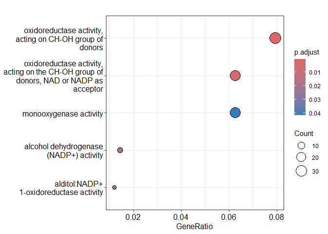<!-- -->

``` r
dotplot(GO_results_CC, showCategory = 20)
```

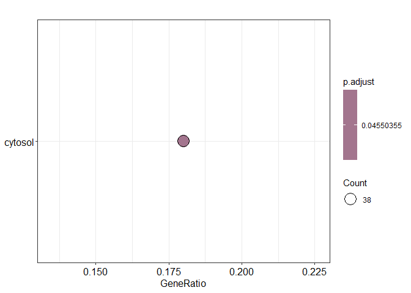<!-- -->

``` r
#dotplot(GO_results_BP, showCategory = 20)
#no results for BP here
```

Now let’s try with up and down regulations separated

``` r
#p-value cutoff
genes_to_test_down <- DandE_ids[which(DandE_ids$padj<0.05 & DandE_ids$log2FoldChange<0),]
#288

genes_to_test_down <- as.character(genes_to_test_down$GeneID)

#now do the GO analysis

GO_results_day4_down_MF <- enrichGO(gene = genes_to_test_down, OrgDb = org.Aflavus.eg.db, keyType = "ENTREZID", ont="MF", universe=all_genes)

GO_results_day4_down_CC <- enrichGO(gene = genes_to_test_down, OrgDb = org.Aflavus.eg.db, keyType = "ENTREZID", ont="CC", universe=all_genes)

GO_results_day4_down_BP <- enrichGO(gene = genes_to_test_down, OrgDb = org.Aflavus.eg.db, keyType = "ENTREZID", ont="BP", universe=all_genes)

#plot
#FIGURE 2 bottom right
dotplot(GO_results_day4_down_MF, showCategory = 20)
```

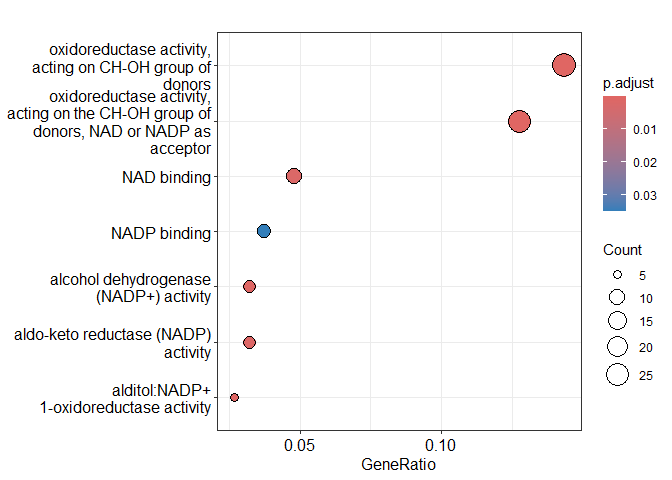<!-- -->

``` r
dotplot(GO_results_day4_down_CC, showCategory = 20)
```

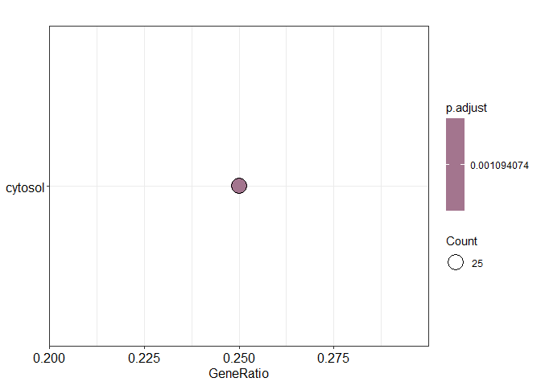<!-- -->

``` r
dotplot(GO_results_day4_down_BP, showCategory = 50)
```

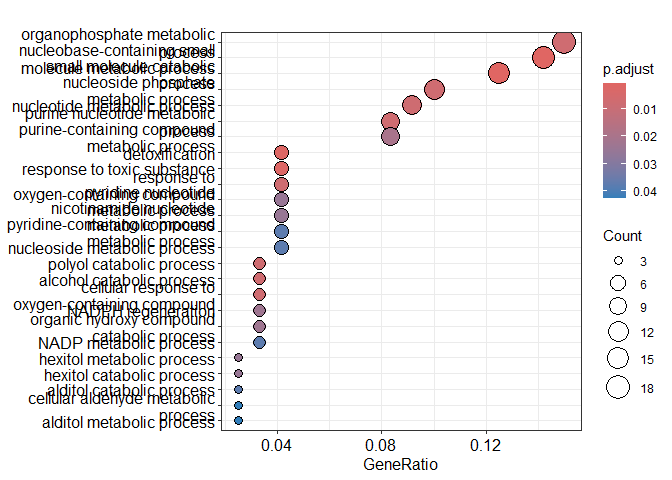<!-- -->

``` r
#write.csv(GO_results_day4_down_CC@result, file="GO_results_day4_down_CC.csv")
##now up


#p-value cutoff
genes_to_test_up <- DandE_ids[which(DandE_ids$padj<0.05 & DandE_ids$log2FoldChange>0),]
#314

genes_to_test_up <- as.character(genes_to_test_up$GeneID)
length(genes_to_test_up)
```

    ## [1] 314

``` r
#now do the GO analysis

GO_results_day4_up_MF <- enrichGO(gene = genes_to_test_up, OrgDb = org.Aflavus.eg.db, keyType = "ENTREZID", ont="MF", universe=all_genes)

GO_results_day4_up_CC <- enrichGO(gene = genes_to_test_up, OrgDb = org.Aflavus.eg.db, keyType = "ENTREZID", ont="CC", universe=all_genes)

GO_results_day4_up_BP <- enrichGO(gene = genes_to_test_up, OrgDb = org.Aflavus.eg.db, keyType = "ENTREZID", ont="BP", universe=all_genes)

#plot
#FIGURE 2 bottom right
dotplot(GO_results_day4_up_MF, showCategory = 20)
```

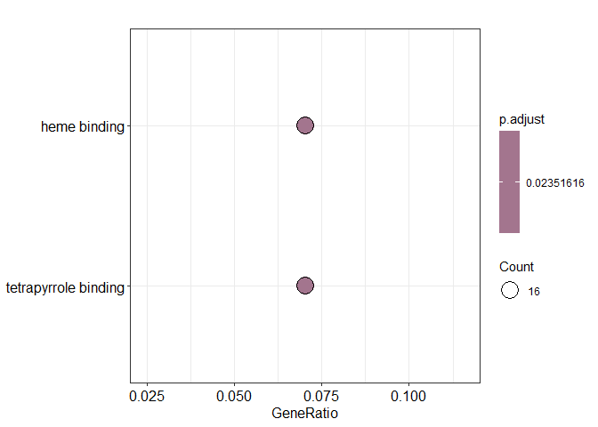<!-- -->

``` r
#dotplot(GO_results_day4_up_CC, showCategory = 20)
dotplot(GO_results_day4_up_BP, showCategory = 50)
```

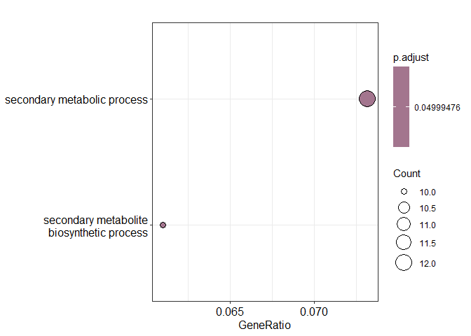<!-- -->

``` r
#write.csv(GO_results_day4_up_BP@result, file="GO_results_day4_up_BP.csv")
```

\#Gene set enrichment test

``` r
#use the not shrunken data

de_mnonly_day4_forGSEA <- as_tibble(de_mnonly_day4)

de_mnonly_day4_forGSEA$seqID <- rownames(de_mnonly_day4)

DandE_ids_forGSEA <- left_join(de_mnonly_day4_forGSEA,Aflavus_geneIDs, by="seqID")

genes <- DandE_ids_forGSEA$log2FoldChange
names(genes) <- DandE_ids_forGSEA$GeneID
genes=sort(genes, decreasing = TRUE)

#now try with a different metric
#genes <- (DandE_ids_forGSEA$log2FoldChange * -log10(DandE_ids_forGSEA$padj))
#names(genes) <- DandE_ids_forGSEA$GeneID
#genes <- sort(genes, decreasing = TRUE)


gse <- gseGO(geneList=genes, 
             ont ="ALL", 
             keyType = "ENTREZID", 
             verbose = TRUE, 
             OrgDb = org.Aflavus.eg.db)
```

    ## using 'fgsea' for GSEA analysis, please cite Korotkevich et al (2019).

    ## preparing geneSet collections...

    ## GSEA analysis...

    ## Warning in preparePathwaysAndStats(pathways, stats, minSize, maxSize,
    ## gseaParam, : There are duplicate gene names, fgsea may produce unexpected
    ## results.

    ## leading edge analysis...

    ## done...

``` r
gse_result <- gse@result

#write.csv(gse_result, file="gsea_expdande_day4_bylog2FC.csv")


gseaplot(gse, geneSetID = 1)
```

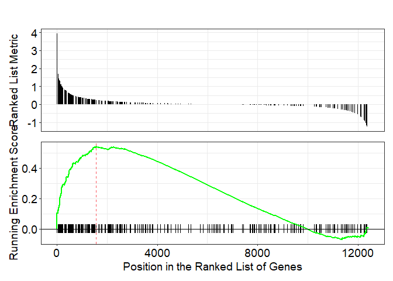<!-- -->

``` r
ridgeplot(gse)
```

    ## Picking joint bandwidth of 0.358

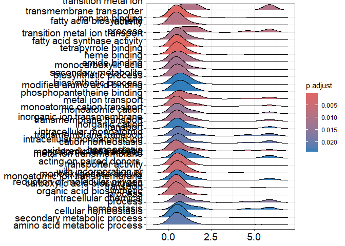<!-- -->

``` r
#filter by significance first
sig_gse <- gse[gse@result$p.adjust < 0.01, ]


gse_MF <- gse
gse_MF@result <- gse@result[gse@result$ONTOLOGY == "MF", ]
ridgeplot(gse_MF, showCategory = 5)
```

    ## Picking joint bandwidth of 0.134

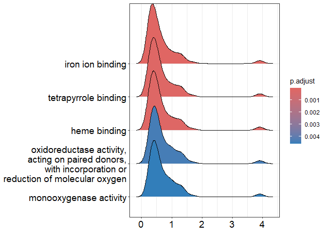<!-- -->

``` r
#extract sig GO terms
sig_gse_01 <- gse@result %>% filter(p.adjust < 0.01)
nrow(sig_gse_01)
```

    ## [1] 13

Now let’s run the DE analysis for the rest of the comparisons.

``` r
#read in as data 
se_star_mnonly_day7 <- DESeqDataSetFromHTSeqCount(sampleTable = sampletable_mnonly_day7,
                        directory = "./deseq2/all_combined",
                        design = ~ Experiment + AFB1)
```

    ## Warning in DESeqDataSet(se, design = design, ignoreRank): some variables in
    ## design formula are characters, converting to factors

``` r
#read in as data 
se_star_nomn_day4 <- DESeqDataSetFromHTSeqCount(sampleTable = sampletable_nomn_day4,
                        directory = "./deseq2/all_combined",
                        design = ~ Experiment + AFB1)
```

    ## Warning in DESeqDataSet(se, design = design, ignoreRank): some variables in
    ## design formula are characters, converting to factors

``` r
#read in as data 
se_star_nomn_day7 <- DESeqDataSetFromHTSeqCount(sampleTable = sampletable_nomn_day7,
                        directory = "./deseq2/all_combined",
                        design = ~ Experiment + AFB1)
```

    ## Warning in DESeqDataSet(se, design = design, ignoreRank): some variables in
    ## design formula are characters, converting to factors

``` r
#filter data
nrow(se_star_mnonly_day7)
```

    ## [1] 13136

``` r
nrow(se_star_nomn_day4)
```

    ## [1] 13136

``` r
nrow(se_star_nomn_day7)
```

    ## [1] 13136

``` r
#13136

se_star_mnonly_day7 <- se_star_mnonly_day7[rowSums(counts(se_star_mnonly_day7)) > 10, ]

se_star_nomn_day4 <- se_star_nomn_day4[rowSums(counts(se_star_nomn_day4)) > 10, ]

se_star_nomn_day7 <- se_star_nomn_day7[rowSums(counts(se_star_nomn_day7)) > 10, ]

#check filter
nrow(se_star_mnonly_day7)
```

    ## [1] 12689

``` r
#12689
nrow(se_star_nomn_day4)
```

    ## [1] 11961

``` r
#11961
nrow(se_star_nomn_day7)
```

    ## [1] 12282

``` r
#12282

#run the model and normalize counts
se_star_model_mnonly_day7 <- DESeq(se_star_mnonly_day7)
```

    ## estimating size factors

    ## estimating dispersions

    ## gene-wise dispersion estimates

    ## mean-dispersion relationship

    ## final dispersion estimates

    ## fitting model and testing

``` r
se_star_model_nomn_day4 <- DESeq(se_star_nomn_day4)
```

    ## estimating size factors

    ## estimating dispersions

    ## gene-wise dispersion estimates

    ## mean-dispersion relationship

    ## final dispersion estimates

    ## fitting model and testing

``` r
se_star_model_nomn_day7 <- DESeq(se_star_nomn_day7)
```

    ## estimating size factors

    ## estimating dispersions

    ## gene-wise dispersion estimates

    ## mean-dispersion relationship

    ## final dispersion estimates

    ## fitting model and testing

``` r
#normalize
norm_counts_mnonly_day7 <- log2(counts(se_star_model_mnonly_day7, normalized = TRUE)+1)
norm_counts_nomn_day4 <- log2(counts(se_star_model_nomn_day4, normalized = TRUE)+1)
norm_counts_nomn_day7 <- log2(counts(se_star_model_nomn_day7, normalized = TRUE)+1)

#visualization
vsd_mnonly_day7 <- vst(se_star_model_mnonly_day7)
vsd_nomn_day4 <- vst(se_star_model_nomn_day4)
vsd_nomn_day7 <- vst(se_star_model_nomn_day7)
sampleDistMatrix_mnonly_day7 <- as.matrix(dist(t(assay(vsd_mnonly_day7))))
sampleDistMatrix_nomn_day4 <- as.matrix(dist(t(assay(vsd_nomn_day4))))
sampleDistMatrix_nomn_day7 <- as.matrix(dist(t(assay(vsd_nomn_day7))))

#heatmap
pheatmap(sampleDistMatrix_mnonly_day7, clustering_method="ward.D2")
```

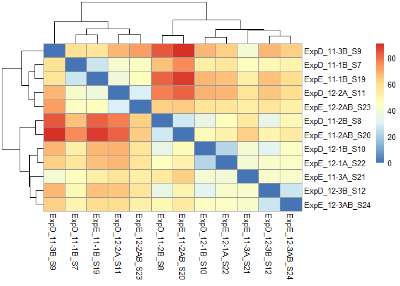<!-- -->

``` r
pheatmap(sampleDistMatrix_nomn_day4, clustering_method="ward.D2")
```

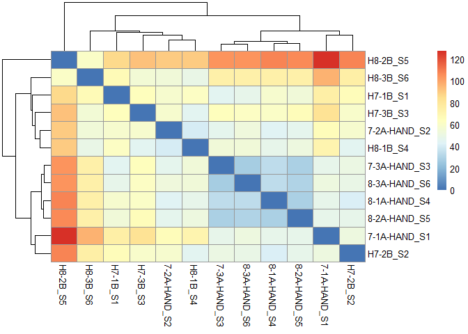<!-- -->

``` r
pheatmap(sampleDistMatrix_nomn_day7, clustering_method="ward.D2")
```

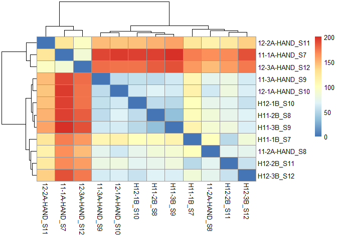<!-- -->

``` r
#pca
p_mn7 <- plotPCA(object=vsd_mnonly_day7, intgroup= "AFB1")
```

    ## using ntop=500 top features by variance

``` r
p_mn7 + theme_bw() + geom_point(size=5)
```

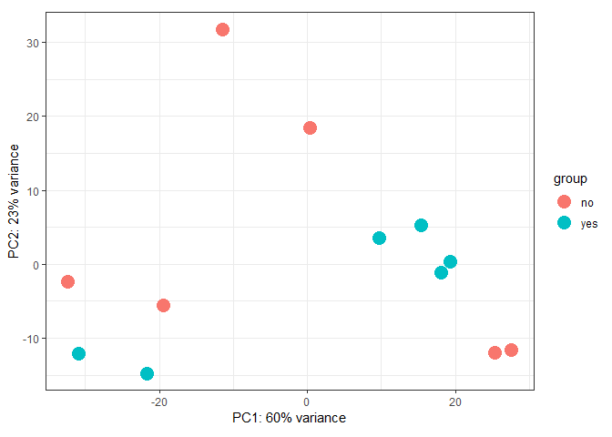<!-- -->

``` r
p_nomn4 <- plotPCA(object=vsd_nomn_day4, intgroup= "AFB1")
```

    ## using ntop=500 top features by variance

``` r
p_nomn4 + theme_bw() + geom_point(size=5)
```

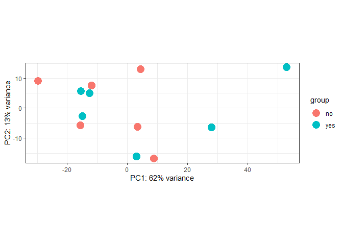<!-- -->

``` r
p_nomn7 <- plotPCA(object=vsd_nomn_day7, intgroup= "AFB1")
```

    ## using ntop=500 top features by variance

``` r
p_nomn7 + theme_bw() + geom_point(size=5)
```

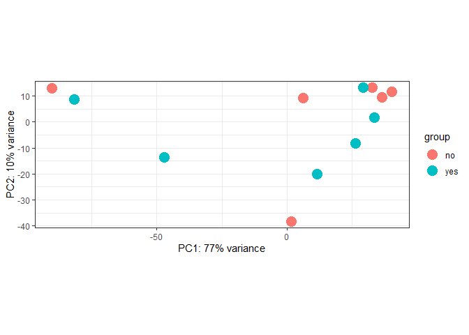<!-- -->

``` r
#shrink
de_shrinkmnonly_day7 <- lfcShrink(dds = se_star_model_mnonly_day7,
                 coef="AFB1_yes_vs_no",
         type="apeglm")
```

    ## using 'apeglm' for LFC shrinkage. If used in published research, please cite:
    ##     Zhu, A., Ibrahim, J.G., Love, M.I. (2018) Heavy-tailed prior distributions for
    ##     sequence count data: removing the noise and preserving large differences.
    ##     Bioinformatics. https://doi.org/10.1093/bioinformatics/bty895

``` r
de_shrinknomn_day4 <- lfcShrink(dds = se_star_model_nomn_day4,
                 coef="AFB1_yes_vs_no",
         type="apeglm")
```

    ## using 'apeglm' for LFC shrinkage. If used in published research, please cite:
    ##     Zhu, A., Ibrahim, J.G., Love, M.I. (2018) Heavy-tailed prior distributions for
    ##     sequence count data: removing the noise and preserving large differences.
    ##     Bioinformatics. https://doi.org/10.1093/bioinformatics/bty895

``` r
de_shrinknomn_day7 <- lfcShrink(dds = se_star_model_nomn_day7,
                 coef="AFB1_yes_vs_no",
         type="apeglm")
```

    ## using 'apeglm' for LFC shrinkage. If used in published research, please cite:
    ##     Zhu, A., Ibrahim, J.G., Love, M.I. (2018) Heavy-tailed prior distributions for
    ##     sequence count data: removing the noise and preserving large differences.
    ##     Bioinformatics. https://doi.org/10.1093/bioinformatics/bty895

``` r
#for volcano plot


# Example: using your shrunken results
df <- as.data.frame(de_shrinknomn_day4)

# Add significance categories
df <- df %>%
  mutate(
    neglogp = -log10(padj),
    sig = case_when(
      padj < 0.05 & log2FoldChange > 1  ~ "Up",
      padj < 0.05 & log2FoldChange < -1 ~ "Down",
      TRUE                              ~ "NS"
    )
  )

# Basic volcano plot
ggplot(df, aes(x = log2FoldChange, y = neglogp)) +
  geom_point(aes(color = sig), alpha = 0.7, size = 2) +
  scale_color_manual(
    values = c("Up" = "#D55E00", "Down" = "#0072B2", "NS" = "grey70")
  ) +
  geom_vline(xintercept = c(-1, 1), linetype = "dashed", color = "grey40") +
  geom_hline(yintercept = -log10(0.05), linetype = "dashed", color = "grey40") +
  labs(
    x = "Log2 Fold Change (shrunken)",
    y = "-log10(adjusted p-value)",
    color = "Direction",
    title = "Volcano Plot: AFB1 yes vs no (Mn- Day 7)"
  ) +
  theme_bw(base_size = 14) +
  theme(
    plot.title = element_text(hjust = 0.5),
    legend.position = "right"
  )
```

    ## Warning: Removed 66 rows containing missing values or values outside the scale range
    ## (`geom_point()`).

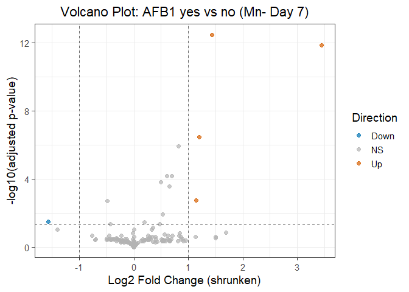<!-- -->

``` r
#add in gene labels
top_genes <- df %>%
  filter(padj < 0.05) %>%
  arrange(padj) %>%
  slice(1:5)

ggplot(df, aes(x = log2FoldChange, y = neglogp)) +
  geom_point(aes(color = sig), alpha = 0.7, size = 2) +
  geom_text_repel(
    data = top_genes,
    aes(label = rownames(top_genes)),
    size = 3,
    max.overlaps = Inf
  ) +
  scale_color_manual(
    values = c("Up" = "#D55E00", "Down" = "#0072B2", "NS" = "grey70")
  ) +
  geom_vline(xintercept = c(-1, 1), linetype = "dashed", color = "grey40") +
  geom_hline(yintercept = -log10(0.05), linetype = "dashed", color = "grey40") +
  theme_bw(base_size = 14)
```

    ## Warning: Removed 66 rows containing missing values or values outside the scale range
    ## (`geom_point()`).

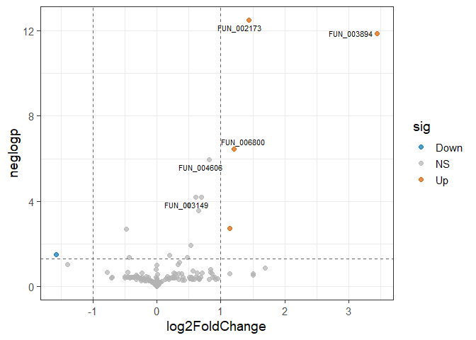<!-- -->

``` r
# check first rows of both results
head(de_mnonly_day4)
```

    ## log2 fold change (MLE): AFB1 yes vs no 
    ## Wald test p-value: AFB1 yes vs no 
    ## DataFrame with 6 rows and 6 columns
    ##              baseMean log2FoldChange     lfcSE      stat    pvalue      padj
    ##             <numeric>      <numeric> <numeric> <numeric> <numeric> <numeric>
    ## FUN_000001 1860.29121       0.902353  0.400419  2.253525 0.0242261  0.200002
    ## FUN_000002   17.93373       0.771924  0.496258  1.555489 0.1198296  0.476952
    ## FUN_000003   22.17016       0.237367  0.580619  0.408818 0.6826733  0.923241
    ## FUN_000005 1553.63152       0.468972  0.486136  0.964693 0.3346987  0.742634
    ## FUN_000006    3.12998       1.266214  0.922639  1.372383 0.1699442        NA
    ## FUN_000008   70.57914      -0.375487  0.388740 -0.965908 0.3340904  0.742555

``` r
head(de_shrinkmnonly_day4)
```

    ## log2 fold change (MAP): AFB1 yes vs no 
    ## Wald test p-value: AFB1 yes vs no 
    ## DataFrame with 6 rows and 5 columns
    ##              baseMean log2FoldChange     lfcSE    pvalue      padj
    ##             <numeric>      <numeric> <numeric> <numeric> <numeric>
    ## FUN_000001 1860.29121     0.03886748 0.0918763 0.0242261  0.200002
    ## FUN_000002   17.93373     0.02016455 0.0817801 0.1198296  0.476952
    ## FUN_000003   22.17016     0.00436230 0.0784606 0.6826733  0.923241
    ## FUN_000005 1553.63152     0.01248933 0.0793832 0.3346987  0.742634
    ## FUN_000006    3.12998     0.00908438 0.0795031 0.1699442        NA
    ## FUN_000008   70.57914    -0.01461420 0.0794557 0.3340904  0.742555

Now let’s analyze the gene list for GO overrepresentation and GSEA

``` r
#add seqID col
#using the shrunken data for the GO analysis
de_shrinkmnonly_day7_forGO <- as_tibble(de_shrinkmnonly_day7)
de_shrinkmnonly_day7_forGO$seqID <- rownames(de_shrinkmnonly_day7)

de_shrinknomn_day4_forGO <- as_tibble(de_shrinknomn_day4)
de_shrinknomn_day4_forGO$seqID <- rownames(de_shrinknomn_day4)

#join for aflavus GENEIDs
#read in table matching AF36 genes to gene IDs
Aflavus_geneIDs <- read.csv(file="af36_gene_ids.csv")
colnames(Aflavus_geneIDs)[1] <- "seqID"

#rename
de_shrink7_rename <- mutate(as_tibble(de_shrinkmnonly_day7), seqID = rownames(de_shrinkmnonly_day7))

de_shrink_nomn_4_rename <- mutate(as_tibble(de_shrinknomn_day4), seqID = rownames(de_shrinknomn_day4))

#join
DandE_ids_7 <- left_join(de_shrinkmnonly_day7_forGO,Aflavus_geneIDs, by="seqID")
AandB_ids_4 <- left_join(de_shrinknomn_day4_forGO,Aflavus_geneIDs, by="seqID")

#all genes >10 in dataset
all_genes <- as.character(DandE_ids_7$GeneID)
all_genes_4 <- as.character(AandB_ids_4$GeneID)

#p-value cutoff
genes_to_test <- DandE_ids_7[which(DandE_ids_7$padj<0.05),]
genes_to_test_4 <- AandB_ids_4[which(AandB_ids_4$padj<0.05),]

genes_to_test <- as.character(genes_to_test$GeneID)
genes_to_test_4 <- as.character(genes_to_test_4$GeneID)

#see if the geneIDs are in the database
length(which(!(genes_to_test %in% keys(org.Aflavus.eg.db))))
```

    ## [1] 0

``` r
length(which(!(genes_to_test_4 %in% keys(org.Aflavus.eg.db))))
```

    ## [1] 0

``` r
#0 not in the database
length(which((genes_to_test %in% keys(org.Aflavus.eg.db))))
```

    ## [1] 54

``` r
length(which((genes_to_test_4 %in% keys(org.Aflavus.eg.db))))
```

    ## [1] 15

``` r
#54 for mn+ day 7
#15 for mn- day 4

#now do the GO analysis

GO_results_MF <- enrichGO(gene = genes_to_test, OrgDb = org.Aflavus.eg.db, keyType = "ENTREZID", ont="MF", universe=all_genes)

GO_results_MF_4 <- enrichGO(gene = genes_to_test_4, OrgDb = org.Aflavus.eg.db, keyType = "ENTREZID", ont="MF", universe=all_genes_4)

GO_results_CC <- enrichGO(gene = genes_to_test, OrgDb = org.Aflavus.eg.db, keyType = "ENTREZID", ont="CC", universe=all_genes)

GO_results_CC_4 <- enrichGO(gene = genes_to_test_4, OrgDb = org.Aflavus.eg.db, keyType = "ENTREZID", ont="CC", universe=all_genes_4)

GO_results_BP <- enrichGO(gene = genes_to_test, OrgDb = org.Aflavus.eg.db, keyType = "ENTREZID", ont="BP", universe=all_genes)

GO_results_BP_4 <- enrichGO(gene = genes_to_test_4, OrgDb = org.Aflavus.eg.db, keyType = "ENTREZID", ont="BP", universe = all_genes_4)

#plot
#NO SIGNIFICANT GO TERMS
#dotplot(GO_results_MF, showCategory = 20)
#dotplot(GO_results_CC, showCategory = 20)
#dotplot(GO_results_BP, showCategory = 20)
#dotplot(GO_results_MF_4, showCategory = 20)
#dotplot(GO_results_CC_4, showCategory = 20)
#dotplot(GO_results_BP_4, showCategory = 20)
```

\#Gene set enrichment test

``` r
#use the not shrunken data
de_mnonly_day7 <- results(object = se_star_model_mnonly_day7, name="AFB1_yes_vs_no")

de_nomn_day4 <- results(object = se_star_model_nomn_day4, name="AFB1_yes_vs_no")

de_nomn_day7 <- results(object = se_star_model_nomn_day7, name="AFB1_yes_vs_no")

#convert
de_mnonly_day7_forGSEA <- as_tibble(de_mnonly_day7)
de_nomn_day4_forGSEA <- as_tibble(de_nomn_day4)
de_nomn_day7_forGSEA <- as_tibble(de_nomn_day7)

de_mnonly_day7_forGSEA$seqID <- rownames(de_mnonly_day7)
de_nomn_day4_forGSEA$seqID <- rownames(de_nomn_day4)
de_nomn_day7_forGSEA$seqID <- rownames(de_nomn_day7)

DandE_ids_7_forGSEA <- left_join(de_mnonly_day7_forGSEA,Aflavus_geneIDs, by="seqID")
AandB_ids_4_forGSEA <- left_join(de_nomn_day4_forGSEA,Aflavus_geneIDs, by="seqID")
AandB_ids_7_forGSEA <- left_join(de_nomn_day7_forGSEA,Aflavus_geneIDs, by="seqID")

#now try using the Wald stat for ranking rather than log2FC
#going to try a new stat.

genes <- DandE_ids_7_forGSEA$log2FoldChange
names(genes) <- DandE_ids_7_forGSEA$GeneID
genes <- sort(genes, decreasing = TRUE)

genes_4 <- AandB_ids_4_forGSEA$log2FoldChange
names(genes_4) <- AandB_ids_4_forGSEA$GeneID
genes_4 <- sort(genes_4, decreasing = TRUE)

genes_7 <- AandB_ids_7_forGSEA$log2FoldChange
names(genes_7) <- AandB_ids_7_forGSEA$GeneID
genes_7 <- sort(genes_7, decreasing = TRUE)


gse <- gseGO(geneList=genes, 
             ont ="ALL", 
             keyType = "ENTREZID", 
             verbose = TRUE, 
             OrgDb = org.Aflavus.eg.db)
```

    ## using 'fgsea' for GSEA analysis, please cite Korotkevich et al (2019).

    ## preparing geneSet collections...

    ## GSEA analysis...

    ## Warning in preparePathwaysAndStats(pathways, stats, minSize, maxSize,
    ## gseaParam, : There are duplicate gene names, fgsea may produce unexpected
    ## results.

    ## no term enriched under specific pvalueCutoff...

``` r
gse_4 <- gseGO(geneList=genes_4, 
             ont ="ALL", 
             keyType = "ENTREZID", 
             verbose = TRUE, 
             OrgDb = org.Aflavus.eg.db)
```

    ## using 'fgsea' for GSEA analysis, please cite Korotkevich et al (2019).

    ## preparing geneSet collections...

    ## GSEA analysis...

    ## Warning in preparePathwaysAndStats(pathways, stats, minSize, maxSize,
    ## gseaParam, : There are duplicate gene names, fgsea may produce unexpected
    ## results.

    ## leading edge analysis...

    ## done...

``` r
gse_7 <- gseGO(geneList=genes_7, 
             ont ="ALL", 
             keyType = "ENTREZID", 
             verbose = TRUE, 
             OrgDb = org.Aflavus.eg.db)
```

    ## using 'fgsea' for GSEA analysis, please cite Korotkevich et al (2019).

    ## preparing geneSet collections...

    ## GSEA analysis...

    ## Warning in preparePathwaysAndStats(pathways, stats, minSize, maxSize,
    ## gseaParam, : There are duplicate gene names, fgsea may produce unexpected
    ## results.

    ## Warning in fgseaMultilevel(pathways = pathways, stats = stats, minSize =
    ## minSize, : For some pathways, in reality P-values are less than 1e-10. You can
    ## set the `eps` argument to zero for better estimation.

    ## leading edge analysis...

    ## done...

``` r
gse_result <- gse@result
gse_result_4 <- gse_4@result
gse_result_7 <- gse_7@result

#write.csv(gse_result, file="gsea_expdande_day7_bylog2FC.csv")
#write.csv(gse_result_4, file="gsea_expaandb_day4_bylog2FC.csv")
#write.csv(gse_result_7, file="gsea_expaandb_day7_bylog2FC.csv")
```

Going to try to make a chord diagram separate by three modules for the
GSEA from day 4 mn+

``` r
#read in gsea
gsea <- read_csv("gsea_expdande_day4_bylog2FC.csv")
```

    ## New names:
    ## Rows: 39 Columns: 13
    ## ── Column specification
    ## ──────────────────────────────────────────────────────── Delimiter: "," chr
    ## (6): ...1, ONTOLOGY, ID, Description, leading_edge, core_enrichment dbl (7):
    ## setSize, enrichmentScore, NES, pvalue, p.adjust, qvalue, rank
    ## ℹ Use `spec()` to retrieve the full column specification for this data. ℹ
    ## Specify the column types or set `show_col_types = FALSE` to quiet this message.
    ## • `` -> `...1`

``` r
#extract core enrichment genes
gsea_long <- gsea %>%
  mutate(core_genes = str_split(core_enrichment, "/")) %>%
  unnest(core_genes) %>%
  dplyr::select(Description, ID, ONTOLOGY, core_genes)

#assign each go term to module
module_assignment <- tribble(
  ~ID, ~module,
  # MODULE 1 — Metal Ion Transport & Homeostasis
  "GO:0006812","Metal Homeostasis",
  "GO:0000041","Metal Homeostasis",
  "GO:0030001","Metal Homeostasis",
  "GO:0098660","Metal Homeostasis",
  "GO:0006811","Metal Homeostasis",
  "GO:0098655","Metal Homeostasis",
  "GO:0006873","Metal Homeostasis",
  "GO:0030003","Metal Homeostasis",
  "GO:0098662","Metal Homeostasis",
  "GO:0050801","Metal Homeostasis",
  "GO:0019725","Metal Homeostasis",
  "GO:0055080","Metal Homeostasis",
  "GO:0034220","Metal Homeostasis",
  "GO:0055082","Metal Homeostasis",
  "GO:0098771","Metal Homeostasis",
  "GO:0042592","Metal Homeostasis",
  "GO:0046915","Metal Homeostasis",
  "GO:0046873","Metal Homeostasis",
  "GO:0005506","Metal Homeostasis",

  # MODULE 2 — Oxidative / Redox Detox
  "GO:0044550","Redox Detox",
  "GO:0019748","Redox Detox",
  "GO:0006520","Redox Detox",
  "GO:0044283","Redox Detox",
  "GO:0020037","Redox Detox",
  "GO:0046906","Redox Detox",
  "GO:0004497","Redox Detox",
  "GO:0016705","Redox Detox",
  "GO:0008238","Redox Detox",
  "GO:0019842","Redox Detox",

  # MODULE 3 — Fatty Acid / Organic Acid Biosynthesis
  "GO:0016053","Lipid/Organic Acid",
  "GO:0046394","Lipid/Organic Acid",
  "GO:0006633","Lipid/Organic Acid",
  "GO:0072330","Lipid/Organic Acid",
  "GO:0044283","Lipid/Organic Acid",
  "GO:0004312","Lipid/Organic Acid",
  "GO:0033218","Lipid/Organic Acid",
  "GO:0031177","Lipid/Organic Acid",
  "GO:0072341","Lipid/Organic Acid",
  "GO:0004315","Lipid/Organic Acid"
)

#merge
gsea_mod <- gsea_long %>%
  left_join(module_assignment, by = "ID") %>%
  filter(!is.na(module))
```

    ## Warning in left_join(., module_assignment, by = "ID"): Detected an unexpected many-to-many relationship between `x` and `y`.
    ## ℹ Row 1034 of `x` matches multiple rows in `y`.
    ## ℹ Row 19 of `y` matches multiple rows in `x`.
    ## ℹ If a many-to-many relationship is expected, set `relationship =
    ##   "many-to-many"` to silence this warning.

``` r
#for module 1
mod1 <- gsea_mod %>%
  filter(module == "Metal Homeostasis") %>%
  dplyr::select(gene = core_genes, term = Description)

mod2 <- gsea_mod %>%
  filter(module == "Redox Detox") %>%
  dplyr::select(gene = core_genes, term = Description)

mod3 <- gsea_mod %>%
  filter(module == "Lipid/Organic Acid") %>%
  dplyr::select(gene = core_genes, term = Description)

#plot
plot_chord <- function(df, title = "") {

  # unique terms and genes
  terms <- unique(df$term)
  genes <- unique(df$gene)

  # generate as many colors as needed
  term_colors <- setNames(
    colorRampPalette(c("#1b9e77", "#d95f02", "#7570b3",
                       "#e7298a", "#66a61e", "#e6ab02",
                       "#a6761d", "#666666"))(length(terms)),
    terms
  )

  gene_colors <- setNames(
    colorRampPalette(c("#6a3d9a", "#b15928"))(length(genes)),
    genes
  )

  grid_colors <- c(term_colors, gene_colors)

  circos.clear()
  chordDiagram(
    df,
    grid.col = grid_colors,
    transparency = 0.25,
    annotationTrack = "grid",
    preAllocateTracks = list(track.height = 0.1)
  )

  circos.trackPlotRegion(
    track.index = 1,
    panel.fun = function(x, y) {
      circos.text(
        CELL_META$xcenter,
        CELL_META$ylim[1] - mm_y(2),
        CELL_META$sector.index,
        facing = "clockwise",
        niceFacing = TRUE,
        adj = c(0, 0.5)
      )
    },
    bg.border = NA
  )

  title(title)
}


plot_chord(mod1, "Module 1 — Metal Ion Transport & Homeostasis")
```

    ## Note: 1 point is out of plotting region in sector '64843856', track
    ## '1'.
    ## Note: 1 point is out of plotting region in sector '64843856', track
    ## '1'.
    ## Note: 1 point is out of plotting region in sector '64848042', track
    ## '1'.
    ## Note: 1 point is out of plotting region in sector '64848042', track
    ## '1'.
    ## Note: 1 point is out of plotting region in sector '64852455', track
    ## '1'.
    ## Note: 1 point is out of plotting region in sector '64852455', track
    ## '1'.
    ## Note: 1 point is out of plotting region in sector '64854110', track
    ## '1'.
    ## Note: 1 point is out of plotting region in sector '64854110', track
    ## '1'.
    ## Note: 1 point is out of plotting region in sector '64842345', track
    ## '1'.
    ## Note: 1 point is out of plotting region in sector '64842345', track
    ## '1'.
    ## Note: 1 point is out of plotting region in sector '64846369', track
    ## '1'.
    ## Note: 1 point is out of plotting region in sector '64846369', track
    ## '1'.
    ## Note: 1 point is out of plotting region in sector '64849575', track
    ## '1'.
    ## Note: 1 point is out of plotting region in sector '64849575', track
    ## '1'.
    ## Note: 1 point is out of plotting region in sector '64851601', track
    ## '1'.
    ## Note: 1 point is out of plotting region in sector '64851601', track
    ## '1'.
    ## Note: 1 point is out of plotting region in sector '64852443', track
    ## '1'.
    ## Note: 1 point is out of plotting region in sector '64852443', track
    ## '1'.
    ## Note: 1 point is out of plotting region in sector '64844089', track
    ## '1'.
    ## Note: 1 point is out of plotting region in sector '64844089', track
    ## '1'.
    ## Note: 1 point is out of plotting region in sector '64852448', track
    ## '1'.
    ## Note: 1 point is out of plotting region in sector '64852448', track
    ## '1'.
    ## Note: 1 point is out of plotting region in sector '64850076', track
    ## '1'.
    ## Note: 1 point is out of plotting region in sector '64850076', track
    ## '1'.
    ## Note: 1 point is out of plotting region in sector '64843920', track
    ## '1'.
    ## Note: 1 point is out of plotting region in sector '64843920', track
    ## '1'.
    ## Note: 1 point is out of plotting region in sector '64850609', track
    ## '1'.
    ## Note: 1 point is out of plotting region in sector '64850609', track
    ## '1'.
    ## Note: 1 point is out of plotting region in sector '64852454', track
    ## '1'.
    ## Note: 1 point is out of plotting region in sector '64852454', track
    ## '1'.
    ## Note: 1 point is out of plotting region in sector '64851011', track
    ## '1'.
    ## Note: 1 point is out of plotting region in sector '64851011', track
    ## '1'.
    ## Note: 1 point is out of plotting region in sector '64845770', track
    ## '1'.
    ## Note: 1 point is out of plotting region in sector '64845770', track
    ## '1'.
    ## Note: 1 point is out of plotting region in sector '64843671', track
    ## '1'.
    ## Note: 1 point is out of plotting region in sector '64843671', track
    ## '1'.
    ## Note: 1 point is out of plotting region in sector '64853099', track
    ## '1'.
    ## Note: 1 point is out of plotting region in sector '64853099', track
    ## '1'.
    ## Note: 1 point is out of plotting region in sector '64851600', track
    ## '1'.
    ## Note: 1 point is out of plotting region in sector '64851600', track
    ## '1'.
    ## Note: 1 point is out of plotting region in sector '64853145', track
    ## '1'.
    ## Note: 1 point is out of plotting region in sector '64853145', track
    ## '1'.
    ## Note: 1 point is out of plotting region in sector '64846248', track
    ## '1'.
    ## Note: 1 point is out of plotting region in sector '64846248', track
    ## '1'.
    ## Note: 1 point is out of plotting region in sector '64849930', track
    ## '1'.
    ## Note: 1 point is out of plotting region in sector '64849930', track
    ## '1'.
    ## Note: 1 point is out of plotting region in sector '64845202', track
    ## '1'.
    ## Note: 1 point is out of plotting region in sector '64845202', track
    ## '1'.
    ## Note: 1 point is out of plotting region in sector '64844690', track
    ## '1'.
    ## Note: 1 point is out of plotting region in sector '64844690', track
    ## '1'.
    ## Note: 1 point is out of plotting region in sector '64847357', track
    ## '1'.
    ## Note: 1 point is out of plotting region in sector '64847357', track
    ## '1'.
    ## Note: 1 point is out of plotting region in sector '64846542', track
    ## '1'.
    ## Note: 1 point is out of plotting region in sector '64846542', track
    ## '1'.
    ## Note: 1 point is out of plotting region in sector '64853143', track
    ## '1'.
    ## Note: 1 point is out of plotting region in sector '64853143', track
    ## '1'.
    ## Note: 1 point is out of plotting region in sector '64848450', track
    ## '1'.
    ## Note: 1 point is out of plotting region in sector '64848450', track
    ## '1'.
    ## Note: 1 point is out of plotting region in sector '64844596', track
    ## '1'.
    ## Note: 1 point is out of plotting region in sector '64844596', track
    ## '1'.
    ## Note: 1 point is out of plotting region in sector '64843784', track
    ## '1'.
    ## Note: 1 point is out of plotting region in sector '64843784', track
    ## '1'.
    ## Note: 1 point is out of plotting region in sector '64851137', track
    ## '1'.
    ## Note: 1 point is out of plotting region in sector '64851137', track
    ## '1'.
    ## Note: 1 point is out of plotting region in sector '64851492', track
    ## '1'.
    ## Note: 1 point is out of plotting region in sector '64851492', track
    ## '1'.
    ## Note: 1 point is out of plotting region in sector '64846602', track
    ## '1'.
    ## Note: 1 point is out of plotting region in sector '64846602', track
    ## '1'.
    ## Note: 1 point is out of plotting region in sector '64847919', track
    ## '1'.
    ## Note: 1 point is out of plotting region in sector '64847919', track
    ## '1'.
    ## Note: 1 point is out of plotting region in sector '64846273', track
    ## '1'.
    ## Note: 1 point is out of plotting region in sector '64846273', track
    ## '1'.
    ## Note: 1 point is out of plotting region in sector '64854013', track
    ## '1'.
    ## Note: 1 point is out of plotting region in sector '64854013', track
    ## '1'.
    ## Note: 1 point is out of plotting region in sector '64853737', track
    ## '1'.
    ## Note: 1 point is out of plotting region in sector '64853737', track
    ## '1'.
    ## Note: 1 point is out of plotting region in sector '64844680', track
    ## '1'.
    ## Note: 1 point is out of plotting region in sector '64844680', track
    ## '1'.
    ## Note: 1 point is out of plotting region in sector '64852254', track
    ## '1'.
    ## Note: 1 point is out of plotting region in sector '64852254', track
    ## '1'.
    ## Note: 1 point is out of plotting region in sector '64853491', track
    ## '1'.
    ## Note: 1 point is out of plotting region in sector '64853491', track
    ## '1'.
    ## Note: 1 point is out of plotting region in sector '64854080', track
    ## '1'.
    ## Note: 1 point is out of plotting region in sector '64854080', track
    ## '1'.
    ## Note: 1 point is out of plotting region in sector '64847825', track
    ## '1'.
    ## Note: 1 point is out of plotting region in sector '64847825', track
    ## '1'.
    ## Note: 1 point is out of plotting region in sector '64852233', track
    ## '1'.
    ## Note: 1 point is out of plotting region in sector '64852233', track
    ## '1'.
    ## Note: 1 point is out of plotting region in sector '64848871', track
    ## '1'.
    ## Note: 1 point is out of plotting region in sector '64848871', track
    ## '1'.
    ## Note: 1 point is out of plotting region in sector '64850059', track
    ## '1'.
    ## Note: 1 point is out of plotting region in sector '64850059', track
    ## '1'.
    ## Note: 1 point is out of plotting region in sector '64852237', track
    ## '1'.
    ## Note: 1 point is out of plotting region in sector '64852237', track
    ## '1'.
    ## Note: 1 point is out of plotting region in sector '64843240', track
    ## '1'.
    ## Note: 1 point is out of plotting region in sector '64843240', track
    ## '1'.
    ## Note: 1 point is out of plotting region in sector '64846543', track
    ## '1'.
    ## Note: 1 point is out of plotting region in sector '64846543', track
    ## '1'.
    ## Note: 1 point is out of plotting region in sector '64853488', track
    ## '1'.
    ## Note: 1 point is out of plotting region in sector '64853488', track
    ## '1'.
    ## Note: 1 point is out of plotting region in sector '64848387', track
    ## '1'.
    ## Note: 1 point is out of plotting region in sector '64848387', track
    ## '1'.
    ## Note: 1 point is out of plotting region in sector '64846599', track
    ## '1'.
    ## Note: 1 point is out of plotting region in sector '64846599', track
    ## '1'.
    ## Note: 1 point is out of plotting region in sector '64851883', track
    ## '1'.
    ## Note: 1 point is out of plotting region in sector '64851883', track
    ## '1'.
    ## Note: 1 point is out of plotting region in sector '64854006', track
    ## '1'.
    ## Note: 1 point is out of plotting region in sector '64854006', track
    ## '1'.
    ## Note: 1 point is out of plotting region in sector '64844396', track
    ## '1'.
    ## Note: 1 point is out of plotting region in sector '64844396', track
    ## '1'.
    ## Note: 1 point is out of plotting region in sector '64850040', track
    ## '1'.
    ## Note: 1 point is out of plotting region in sector '64850040', track
    ## '1'.
    ## Note: 1 point is out of plotting region in sector '64849607', track
    ## '1'.
    ## Note: 1 point is out of plotting region in sector '64849607', track
    ## '1'.
    ## Note: 1 point is out of plotting region in sector '64851236', track
    ## '1'.
    ## Note: 1 point is out of plotting region in sector '64851236', track
    ## '1'.
    ## Note: 1 point is out of plotting region in sector '64852885', track
    ## '1'.
    ## Note: 1 point is out of plotting region in sector '64852885', track
    ## '1'.
    ## Note: 1 point is out of plotting region in sector '64853986', track
    ## '1'.
    ## Note: 1 point is out of plotting region in sector '64853986', track
    ## '1'.
    ## Note: 1 point is out of plotting region in sector '64847848', track
    ## '1'.
    ## Note: 1 point is out of plotting region in sector '64847848', track
    ## '1'.
    ## Note: 1 point is out of plotting region in sector '64844174', track
    ## '1'.
    ## Note: 1 point is out of plotting region in sector '64844174', track
    ## '1'.
    ## Note: 1 point is out of plotting region in sector '64844683', track
    ## '1'.
    ## Note: 1 point is out of plotting region in sector '64844683', track
    ## '1'.
    ## Note: 1 point is out of plotting region in sector '64849695', track
    ## '1'.
    ## Note: 1 point is out of plotting region in sector '64849695', track
    ## '1'.
    ## Note: 1 point is out of plotting region in sector '64849400', track
    ## '1'.
    ## Note: 1 point is out of plotting region in sector '64849400', track
    ## '1'.
    ## Note: 1 point is out of plotting region in sector '64850612', track
    ## '1'.
    ## Note: 1 point is out of plotting region in sector '64850612', track
    ## '1'.
    ## Note: 1 point is out of plotting region in sector '64843793', track
    ## '1'.
    ## Note: 1 point is out of plotting region in sector '64843793', track
    ## '1'.
    ## Note: 1 point is out of plotting region in sector '64849265', track
    ## '1'.
    ## Note: 1 point is out of plotting region in sector '64849265', track
    ## '1'.
    ## Note: 1 point is out of plotting region in sector '64845990', track
    ## '1'.
    ## Note: 1 point is out of plotting region in sector '64845990', track
    ## '1'.
    ## Note: 1 point is out of plotting region in sector '64844934', track
    ## '1'.
    ## Note: 1 point is out of plotting region in sector '64844934', track
    ## '1'.
    ## Note: 1 point is out of plotting region in sector '64843402', track
    ## '1'.
    ## Note: 1 point is out of plotting region in sector '64843402', track
    ## '1'.
    ## Note: 1 point is out of plotting region in sector '64850698', track
    ## '1'.
    ## Note: 1 point is out of plotting region in sector '64850698', track
    ## '1'.
    ## Note: 1 point is out of plotting region in sector '64850523', track
    ## '1'.
    ## Note: 1 point is out of plotting region in sector '64850523', track
    ## '1'.
    ## Note: 1 point is out of plotting region in sector '64850729', track
    ## '1'.
    ## Note: 1 point is out of plotting region in sector '64850729', track
    ## '1'.
    ## Note: 1 point is out of plotting region in sector '64843441', track
    ## '1'.
    ## Note: 1 point is out of plotting region in sector '64843441', track
    ## '1'.
    ## Note: 1 point is out of plotting region in sector '64846899', track
    ## '1'.
    ## Note: 1 point is out of plotting region in sector '64846899', track
    ## '1'.
    ## Note: 1 point is out of plotting region in sector '64843969', track
    ## '1'.
    ## Note: 1 point is out of plotting region in sector '64843969', track
    ## '1'.
    ## Note: 1 point is out of plotting region in sector '64852806', track
    ## '1'.
    ## Note: 1 point is out of plotting region in sector '64852806', track
    ## '1'.
    ## Note: 1 point is out of plotting region in sector '64847805', track
    ## '1'.
    ## Note: 1 point is out of plotting region in sector '64847805', track
    ## '1'.
    ## Note: 1 point is out of plotting region in sector '64853593', track
    ## '1'.
    ## Note: 1 point is out of plotting region in sector '64853593', track
    ## '1'.
    ## Note: 1 point is out of plotting region in sector '64842421', track
    ## '1'.
    ## Note: 1 point is out of plotting region in sector '64842421', track
    ## '1'.
    ## Note: 1 point is out of plotting region in sector '64844588', track
    ## '1'.
    ## Note: 1 point is out of plotting region in sector '64844588', track
    ## '1'.
    ## Note: 1 point is out of plotting region in sector '64850699', track
    ## '1'.
    ## Note: 1 point is out of plotting region in sector '64850699', track
    ## '1'.
    ## Note: 1 point is out of plotting region in sector '64844153', track
    ## '1'.
    ## Note: 1 point is out of plotting region in sector '64844153', track
    ## '1'.
    ## Note: 1 point is out of plotting region in sector '64853138', track
    ## '1'.
    ## Note: 1 point is out of plotting region in sector '64853138', track
    ## '1'.
    ## Note: 1 point is out of plotting region in sector '64843627', track
    ## '1'.
    ## Note: 1 point is out of plotting region in sector '64843627', track
    ## '1'.
    ## Note: 1 point is out of plotting region in sector '64852053', track
    ## '1'.
    ## Note: 1 point is out of plotting region in sector '64852053', track
    ## '1'.
    ## Note: 1 point is out of plotting region in sector '64852824', track
    ## '1'.
    ## Note: 1 point is out of plotting region in sector '64852824', track
    ## '1'.
    ## Note: 1 point is out of plotting region in sector '64850286', track
    ## '1'.
    ## Note: 1 point is out of plotting region in sector '64850286', track
    ## '1'.
    ## Note: 1 point is out of plotting region in sector '64850524', track
    ## '1'.
    ## Note: 1 point is out of plotting region in sector '64850524', track
    ## '1'.
    ## Note: 1 point is out of plotting region in sector '64842277', track
    ## '1'.
    ## Note: 1 point is out of plotting region in sector '64842277', track
    ## '1'.
    ## Note: 1 point is out of plotting region in sector '64842333', track
    ## '1'.
    ## Note: 1 point is out of plotting region in sector '64842333', track
    ## '1'.
    ## Note: 1 point is out of plotting region in sector '64853748', track
    ## '1'.
    ## Note: 1 point is out of plotting region in sector '64853748', track
    ## '1'.
    ## Note: 1 point is out of plotting region in sector '64853730', track
    ## '1'.
    ## Note: 1 point is out of plotting region in sector '64853730', track
    ## '1'.
    ## Note: 1 point is out of plotting region in sector '64848239', track
    ## '1'.
    ## Note: 1 point is out of plotting region in sector '64848239', track
    ## '1'.
    ## Note: 1 point is out of plotting region in sector '64854068', track
    ## '1'.
    ## Note: 1 point is out of plotting region in sector '64854068', track
    ## '1'.
    ## Note: 1 point is out of plotting region in sector '64845333', track
    ## '1'.
    ## Note: 1 point is out of plotting region in sector '64845333', track
    ## '1'.
    ## Note: 1 point is out of plotting region in sector '64848904', track
    ## '1'.
    ## Note: 1 point is out of plotting region in sector '64848904', track
    ## '1'.
    ## Note: 1 point is out of plotting region in sector '64846250', track
    ## '1'.
    ## Note: 1 point is out of plotting region in sector '64846250', track
    ## '1'.
    ## Note: 1 point is out of plotting region in sector '64848661', track
    ## '1'.
    ## Note: 1 point is out of plotting region in sector '64848661', track
    ## '1'.
    ## Note: 1 point is out of plotting region in sector '64854033', track
    ## '1'.
    ## Note: 1 point is out of plotting region in sector '64854033', track
    ## '1'.
    ## Note: 1 point is out of plotting region in sector '64844154', track
    ## '1'.
    ## Note: 1 point is out of plotting region in sector '64844154', track
    ## '1'.
    ## Note: 1 point is out of plotting region in sector '64849807', track
    ## '1'.
    ## Note: 1 point is out of plotting region in sector '64849807', track
    ## '1'.
    ## Note: 1 point is out of plotting region in sector 'iron ion binding',
    ## track '1'.
    ## Note: 1 point is out of plotting region in sector 'iron ion binding',
    ## track '1'.
    ## Note: 1 point is out of plotting region in sector 'transition metal ion
    ## transmembrane transporter activity', track '1'.
    ## Note: 1 point is out of plotting region in sector 'transition metal ion
    ## transmembrane transporter activity', track '1'.
    ## Note: 1 point is out of plotting region in sector 'monoatomic cation
    ## transport', track '1'.
    ## Note: 1 point is out of plotting region in sector 'monoatomic cation
    ## transport', track '1'.
    ## Note: 1 point is out of plotting region in sector 'monoatomic ion
    ## transport', track '1'.
    ## Note: 1 point is out of plotting region in sector 'monoatomic ion
    ## transport', track '1'.
    ## Note: 1 point is out of plotting region in sector 'metal ion
    ## transport', track '1'.
    ## Note: 1 point is out of plotting region in sector 'metal ion
    ## transport', track '1'.
    ## Note: 1 point is out of plotting region in sector 'transition metal ion
    ## transport', track '1'.
    ## Note: 1 point is out of plotting region in sector 'transition metal ion
    ## transport', track '1'.
    ## Note: 1 point is out of plotting region in sector 'inorganic ion
    ## transmembrane transport', track '1'.
    ## Note: 1 point is out of plotting region in sector 'inorganic ion
    ## transmembrane transport', track '1'.
    ## Note: 1 point is out of plotting region in sector 'intracellular
    ## monoatomic ion homeostasis', track '1'.
    ## Note: 1 point is out of plotting region in sector 'intracellular
    ## monoatomic ion homeostasis', track '1'.
    ## Note: 1 point is out of plotting region in sector 'intracellular
    ## monoatomic cation homeostasis', track '1'.
    ## Note: 1 point is out of plotting region in sector 'intracellular
    ## monoatomic cation homeostasis', track '1'.
    ## Note: 1 point is out of plotting region in sector 'monoatomic cation
    ## transmembrane transport', track '1'.
    ## Note: 1 point is out of plotting region in sector 'monoatomic cation
    ## transmembrane transport', track '1'.
    ## Note: 1 point is out of plotting region in sector 'monoatomic cation
    ## homeostasis', track '1'.
    ## Note: 1 point is out of plotting region in sector 'monoatomic cation
    ## homeostasis', track '1'.
    ## Note: 1 point is out of plotting region in sector 'inorganic cation
    ## transmembrane transport', track '1'.
    ## Note: 1 point is out of plotting region in sector 'inorganic cation
    ## transmembrane transport', track '1'.
    ## Note: 1 point is out of plotting region in sector 'monoatomic ion
    ## homeostasis', track '1'.
    ## Note: 1 point is out of plotting region in sector 'monoatomic ion
    ## homeostasis', track '1'.
    ## Note: 1 point is out of plotting region in sector 'cellular
    ## homeostasis', track '1'.
    ## Note: 1 point is out of plotting region in sector 'cellular
    ## homeostasis', track '1'.
    ## Note: 1 point is out of plotting region in sector 'monoatomic ion
    ## transmembrane transport', track '1'.
    ## Note: 1 point is out of plotting region in sector 'monoatomic ion
    ## transmembrane transport', track '1'.
    ## Note: 1 point is out of plotting region in sector 'inorganic ion
    ## homeostasis', track '1'.
    ## Note: 1 point is out of plotting region in sector 'inorganic ion
    ## homeostasis', track '1'.
    ## Note: 1 point is out of plotting region in sector 'metal ion
    ## transmembrane transporter activity', track '1'.
    ## Note: 1 point is out of plotting region in sector 'metal ion
    ## transmembrane transporter activity', track '1'.
    ## Note: 1 point is out of plotting region in sector 'intracellular
    ## chemical homeostasis', track '1'.
    ## Note: 1 point is out of plotting region in sector 'intracellular
    ## chemical homeostasis', track '1'.

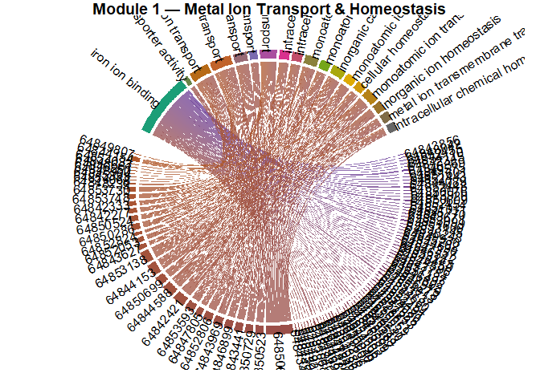<!-- -->

``` r
plot_chord(mod2, "Module 2 — Oxidative / Redox Detox")
```

    ## Note: 1 point is out of plotting region in sector '64843856', track
    ## '1'.
    ## Note: 1 point is out of plotting region in sector '64843856', track
    ## '1'.
    ## Note: 1 point is out of plotting region in sector '64848042', track
    ## '1'.
    ## Note: 1 point is out of plotting region in sector '64848042', track
    ## '1'.
    ## Note: 1 point is out of plotting region in sector '64852455', track
    ## '1'.
    ## Note: 1 point is out of plotting region in sector '64852455', track
    ## '1'.
    ## Note: 1 point is out of plotting region in sector '64854110', track
    ## '1'.
    ## Note: 1 point is out of plotting region in sector '64854110', track
    ## '1'.
    ## Note: 1 point is out of plotting region in sector '64842345', track
    ## '1'.
    ## Note: 1 point is out of plotting region in sector '64842345', track
    ## '1'.
    ## Note: 1 point is out of plotting region in sector '64846369', track
    ## '1'.
    ## Note: 1 point is out of plotting region in sector '64846369', track
    ## '1'.
    ## Note: 1 point is out of plotting region in sector '64849575', track
    ## '1'.
    ## Note: 1 point is out of plotting region in sector '64849575', track
    ## '1'.
    ## Note: 1 point is out of plotting region in sector '64851601', track
    ## '1'.
    ## Note: 1 point is out of plotting region in sector '64851601', track
    ## '1'.
    ## Note: 1 point is out of plotting region in sector '64852443', track
    ## '1'.
    ## Note: 1 point is out of plotting region in sector '64852443', track
    ## '1'.
    ## Note: 1 point is out of plotting region in sector '64844089', track
    ## '1'.
    ## Note: 1 point is out of plotting region in sector '64844089', track
    ## '1'.
    ## Note: 1 point is out of plotting region in sector '64852448', track
    ## '1'.
    ## Note: 1 point is out of plotting region in sector '64852448', track
    ## '1'.
    ## Note: 1 point is out of plotting region in sector '64850076', track
    ## '1'.
    ## Note: 1 point is out of plotting region in sector '64850076', track
    ## '1'.
    ## Note: 1 point is out of plotting region in sector '64843920', track
    ## '1'.
    ## Note: 1 point is out of plotting region in sector '64843920', track
    ## '1'.
    ## Note: 1 point is out of plotting region in sector '64850609', track
    ## '1'.
    ## Note: 1 point is out of plotting region in sector '64850609', track
    ## '1'.
    ## Note: 1 point is out of plotting region in sector '64852454', track
    ## '1'.
    ## Note: 1 point is out of plotting region in sector '64852454', track
    ## '1'.
    ## Note: 1 point is out of plotting region in sector '64851011', track
    ## '1'.
    ## Note: 1 point is out of plotting region in sector '64851011', track
    ## '1'.
    ## Note: 1 point is out of plotting region in sector '64845770', track
    ## '1'.
    ## Note: 1 point is out of plotting region in sector '64845770', track
    ## '1'.
    ## Note: 1 point is out of plotting region in sector '64853099', track
    ## '1'.
    ## Note: 1 point is out of plotting region in sector '64853099', track
    ## '1'.
    ## Note: 1 point is out of plotting region in sector '64851600', track
    ## '1'.
    ## Note: 1 point is out of plotting region in sector '64851600', track
    ## '1'.
    ## Note: 1 point is out of plotting region in sector '64853145', track
    ## '1'.
    ## Note: 1 point is out of plotting region in sector '64853145', track
    ## '1'.
    ## Note: 1 point is out of plotting region in sector '64846248', track
    ## '1'.
    ## Note: 1 point is out of plotting region in sector '64846248', track
    ## '1'.
    ## Note: 1 point is out of plotting region in sector '64849930', track
    ## '1'.
    ## Note: 1 point is out of plotting region in sector '64849930', track
    ## '1'.
    ## Note: 1 point is out of plotting region in sector '64845202', track
    ## '1'.
    ## Note: 1 point is out of plotting region in sector '64845202', track
    ## '1'.
    ## Note: 1 point is out of plotting region in sector '64847357', track
    ## '1'.
    ## Note: 1 point is out of plotting region in sector '64847357', track
    ## '1'.
    ## Note: 1 point is out of plotting region in sector '64853625', track
    ## '1'.
    ## Note: 1 point is out of plotting region in sector '64853625', track
    ## '1'.
    ## Note: 1 point is out of plotting region in sector '64846542', track
    ## '1'.
    ## Note: 1 point is out of plotting region in sector '64846542', track
    ## '1'.
    ## Note: 1 point is out of plotting region in sector '64853143', track
    ## '1'.
    ## Note: 1 point is out of plotting region in sector '64853143', track
    ## '1'.
    ## Note: 1 point is out of plotting region in sector '64848450', track
    ## '1'.
    ## Note: 1 point is out of plotting region in sector '64848450', track
    ## '1'.
    ## Note: 1 point is out of plotting region in sector '64844596', track
    ## '1'.
    ## Note: 1 point is out of plotting region in sector '64844596', track
    ## '1'.
    ## Note: 1 point is out of plotting region in sector '64843784', track
    ## '1'.
    ## Note: 1 point is out of plotting region in sector '64843784', track
    ## '1'.
    ## Note: 1 point is out of plotting region in sector '64851137', track
    ## '1'.
    ## Note: 1 point is out of plotting region in sector '64851137', track
    ## '1'.
    ## Note: 1 point is out of plotting region in sector '64851492', track
    ## '1'.
    ## Note: 1 point is out of plotting region in sector '64851492', track
    ## '1'.
    ## Note: 1 point is out of plotting region in sector '64846602', track
    ## '1'.
    ## Note: 1 point is out of plotting region in sector '64846602', track
    ## '1'.
    ## Note: 1 point is out of plotting region in sector '64852675', track
    ## '1'.
    ## Note: 1 point is out of plotting region in sector '64852675', track
    ## '1'.
    ## Note: 1 point is out of plotting region in sector '64847919', track
    ## '1'.
    ## Note: 1 point is out of plotting region in sector '64847919', track
    ## '1'.
    ## Note: 1 point is out of plotting region in sector '64846273', track
    ## '1'.
    ## Note: 1 point is out of plotting region in sector '64846273', track
    ## '1'.
    ## Note: 1 point is out of plotting region in sector '64854013', track
    ## '1'.
    ## Note: 1 point is out of plotting region in sector '64854013', track
    ## '1'.
    ## Note: 1 point is out of plotting region in sector '64848663', track
    ## '1'.
    ## Note: 1 point is out of plotting region in sector '64848663', track
    ## '1'.
    ## Note: 1 point is out of plotting region in sector '64846114', track
    ## '1'.
    ## Note: 1 point is out of plotting region in sector '64846114', track
    ## '1'.
    ## Note: 1 point is out of plotting region in sector '64853737', track
    ## '1'.
    ## Note: 1 point is out of plotting region in sector '64853737', track
    ## '1'.
    ## Note: 1 point is out of plotting region in sector '64844680', track
    ## '1'.
    ## Note: 1 point is out of plotting region in sector '64844680', track
    ## '1'.
    ## Note: 1 point is out of plotting region in sector '64852254', track
    ## '1'.
    ## Note: 1 point is out of plotting region in sector '64852254', track
    ## '1'.
    ## Note: 1 point is out of plotting region in sector '64853491', track
    ## '1'.
    ## Note: 1 point is out of plotting region in sector '64853491', track
    ## '1'.
    ## Note: 1 point is out of plotting region in sector '64854080', track
    ## '1'.
    ## Note: 1 point is out of plotting region in sector '64854080', track
    ## '1'.
    ## Note: 1 point is out of plotting region in sector '64847825', track
    ## '1'.
    ## Note: 1 point is out of plotting region in sector '64847825', track
    ## '1'.
    ## Note: 1 point is out of plotting region in sector '64852233', track
    ## '1'.
    ## Note: 1 point is out of plotting region in sector '64852233', track
    ## '1'.
    ## Note: 1 point is out of plotting region in sector '64848871', track
    ## '1'.
    ## Note: 1 point is out of plotting region in sector '64848871', track
    ## '1'.
    ## Note: 1 point is out of plotting region in sector '64850059', track
    ## '1'.
    ## Note: 1 point is out of plotting region in sector '64850059', track
    ## '1'.
    ## Note: 1 point is out of plotting region in sector '64852237', track
    ## '1'.
    ## Note: 1 point is out of plotting region in sector '64852237', track
    ## '1'.
    ## Note: 1 point is out of plotting region in sector '64843240', track
    ## '1'.
    ## Note: 1 point is out of plotting region in sector '64843240', track
    ## '1'.
    ## Note: 1 point is out of plotting region in sector '64846543', track
    ## '1'.
    ## Note: 1 point is out of plotting region in sector '64846543', track
    ## '1'.
    ## Note: 1 point is out of plotting region in sector '64853488', track
    ## '1'.
    ## Note: 1 point is out of plotting region in sector '64853488', track
    ## '1'.
    ## Note: 1 point is out of plotting region in sector '64848387', track
    ## '1'.
    ## Note: 1 point is out of plotting region in sector '64848387', track
    ## '1'.
    ## Note: 1 point is out of plotting region in sector '64846599', track
    ## '1'.
    ## Note: 1 point is out of plotting region in sector '64846599', track
    ## '1'.
    ## Note: 1 point is out of plotting region in sector '64850040', track
    ## '1'.
    ## Note: 1 point is out of plotting region in sector '64850040', track
    ## '1'.
    ## Note: 1 point is out of plotting region in sector '64849607', track
    ## '1'.
    ## Note: 1 point is out of plotting region in sector '64849607', track
    ## '1'.
    ## Note: 1 point is out of plotting region in sector '64852885', track
    ## '1'.
    ## Note: 1 point is out of plotting region in sector '64852885', track
    ## '1'.
    ## Note: 1 point is out of plotting region in sector '64844174', track
    ## '1'.
    ## Note: 1 point is out of plotting region in sector '64844174', track
    ## '1'.
    ## Note: 1 point is out of plotting region in sector '64844683', track
    ## '1'.
    ## Note: 1 point is out of plotting region in sector '64844683', track
    ## '1'.
    ## Note: 1 point is out of plotting region in sector '64849400', track
    ## '1'.
    ## Note: 1 point is out of plotting region in sector '64849400', track
    ## '1'.
    ## Note: 1 point is out of plotting region in sector '64850612', track
    ## '1'.
    ## Note: 1 point is out of plotting region in sector '64850612', track
    ## '1'.
    ## Note: 1 point is out of plotting region in sector '64853960', track
    ## '1'.
    ## Note: 1 point is out of plotting region in sector '64853960', track
    ## '1'.
    ## Note: 1 point is out of plotting region in sector '64849265', track
    ## '1'.
    ## Note: 1 point is out of plotting region in sector '64849265', track
    ## '1'.
    ## Note: 1 point is out of plotting region in sector '64849688', track
    ## '1'.
    ## Note: 1 point is out of plotting region in sector '64849688', track
    ## '1'.
    ## Note: 1 point is out of plotting region in sector '64844934', track
    ## '1'.
    ## Note: 1 point is out of plotting region in sector '64844934', track
    ## '1'.
    ## Note: 1 point is out of plotting region in sector '64844485', track
    ## '1'.
    ## Note: 1 point is out of plotting region in sector '64844485', track
    ## '1'.
    ## Note: 1 point is out of plotting region in sector '64846912', track
    ## '1'.
    ## Note: 1 point is out of plotting region in sector '64846912', track
    ## '1'.
    ## Note: 1 point is out of plotting region in sector '64844692', track
    ## '1'.
    ## Note: 1 point is out of plotting region in sector '64844692', track
    ## '1'.
    ## Note: 1 point is out of plotting region in sector '64844540', track
    ## '1'.
    ## Note: 1 point is out of plotting region in sector '64844540', track
    ## '1'.
    ## Note: 1 point is out of plotting region in sector '64843126', track
    ## '1'.
    ## Note: 1 point is out of plotting region in sector '64843126', track
    ## '1'.
    ## Note: 1 point is out of plotting region in sector '64844690', track
    ## '1'.
    ## Note: 1 point is out of plotting region in sector '64844690', track
    ## '1'.
    ## Note: 1 point is out of plotting region in sector '64845476', track
    ## '1'.
    ## Note: 1 point is out of plotting region in sector '64845476', track
    ## '1'.
    ## Note: 1 point is out of plotting region in sector '64847362', track
    ## '1'.
    ## Note: 1 point is out of plotting region in sector '64847362', track
    ## '1'.
    ## Note: 1 point is out of plotting region in sector '64853149', track
    ## '1'.
    ## Note: 1 point is out of plotting region in sector '64853149', track
    ## '1'.
    ## Note: 1 point is out of plotting region in sector '64846267', track
    ## '1'.
    ## Note: 1 point is out of plotting region in sector '64846267', track
    ## '1'.
    ## Note: 1 point is out of plotting region in sector '64848141', track
    ## '1'.
    ## Note: 1 point is out of plotting region in sector '64848141', track
    ## '1'.
    ## Note: 1 point is out of plotting region in sector '64854006', track
    ## '1'.
    ## Note: 1 point is out of plotting region in sector '64854006', track
    ## '1'.
    ## Note: 1 point is out of plotting region in sector '64851146', track
    ## '1'.
    ## Note: 1 point is out of plotting region in sector '64851146', track
    ## '1'.
    ## Note: 1 point is out of plotting region in sector '64850003', track
    ## '1'.
    ## Note: 1 point is out of plotting region in sector '64850003', track
    ## '1'.
    ## Note: 1 point is out of plotting region in sector '64843545', track
    ## '1'.
    ## Note: 1 point is out of plotting region in sector '64843545', track
    ## '1'.
    ## Note: 1 point is out of plotting region in sector '64847068', track
    ## '1'.
    ## Note: 1 point is out of plotting region in sector '64847068', track
    ## '1'.
    ## Note: 1 point is out of plotting region in sector '64843992', track
    ## '1'.
    ## Note: 1 point is out of plotting region in sector '64843992', track
    ## '1'.
    ## Note: 1 point is out of plotting region in sector '64851111', track
    ## '1'.
    ## Note: 1 point is out of plotting region in sector '64851111', track
    ## '1'.
    ## Note: 1 point is out of plotting region in sector '64846465', track
    ## '1'.
    ## Note: 1 point is out of plotting region in sector '64846465', track
    ## '1'.
    ## Note: 1 point is out of plotting region in sector '64851482', track
    ## '1'.
    ## Note: 1 point is out of plotting region in sector '64851482', track
    ## '1'.
    ## Note: 1 point is out of plotting region in sector '64848047', track
    ## '1'.
    ## Note: 1 point is out of plotting region in sector '64848047', track
    ## '1'.
    ## Note: 1 point is out of plotting region in sector '64853635', track
    ## '1'.
    ## Note: 1 point is out of plotting region in sector '64853635', track
    ## '1'.
    ## Note: 1 point is out of plotting region in sector '64842276', track
    ## '1'.
    ## Note: 1 point is out of plotting region in sector '64842276', track
    ## '1'.
    ## Note: 1 point is out of plotting region in sector '64849716', track
    ## '1'.
    ## Note: 1 point is out of plotting region in sector '64849716', track
    ## '1'.
    ## Note: 1 point is out of plotting region in sector '64844689', track
    ## '1'.
    ## Note: 1 point is out of plotting region in sector '64844689', track
    ## '1'.
    ## Note: 1 point is out of plotting region in sector '64852441', track
    ## '1'.
    ## Note: 1 point is out of plotting region in sector '64852441', track
    ## '1'.
    ## Note: 1 point is out of plotting region in sector '64849714', track
    ## '1'.
    ## Note: 1 point is out of plotting region in sector '64849714', track
    ## '1'.
    ## Note: 1 point is out of plotting region in sector '64853708', track
    ## '1'.
    ## Note: 1 point is out of plotting region in sector '64853708', track
    ## '1'.
    ## Note: 1 point is out of plotting region in sector '64849753', track
    ## '1'.
    ## Note: 1 point is out of plotting region in sector '64849753', track
    ## '1'.
    ## Note: 1 point is out of plotting region in sector '64854229', track
    ## '1'.
    ## Note: 1 point is out of plotting region in sector '64854229', track
    ## '1'.
    ## Note: 1 point is out of plotting region in sector '64848036', track
    ## '1'.
    ## Note: 1 point is out of plotting region in sector '64848036', track
    ## '1'.
    ## Note: 1 point is out of plotting region in sector '64852241', track
    ## '1'.
    ## Note: 1 point is out of plotting region in sector '64852241', track
    ## '1'.
    ## Note: 1 point is out of plotting region in sector '64851884', track
    ## '1'.
    ## Note: 1 point is out of plotting region in sector '64851884', track
    ## '1'.
    ## Note: 1 point is out of plotting region in sector '64849715', track
    ## '1'.
    ## Note: 1 point is out of plotting region in sector '64849715', track
    ## '1'.
    ## Note: 1 point is out of plotting region in sector '64849751', track
    ## '1'.
    ## Note: 1 point is out of plotting region in sector '64849751', track
    ## '1'.
    ## Note: 1 point is out of plotting region in sector '64853603', track
    ## '1'.
    ## Note: 1 point is out of plotting region in sector '64853603', track
    ## '1'.
    ## Note: 1 point is out of plotting region in sector '64854480', track
    ## '1'.
    ## Note: 1 point is out of plotting region in sector '64854480', track
    ## '1'.
    ## Note: 1 point is out of plotting region in sector '64846686', track
    ## '1'.
    ## Note: 1 point is out of plotting region in sector '64846686', track
    ## '1'.
    ## Note: 1 point is out of plotting region in sector '64846544', track
    ## '1'.
    ## Note: 1 point is out of plotting region in sector '64846544', track
    ## '1'.
    ## Note: 1 point is out of plotting region in sector '64854230', track
    ## '1'.
    ## Note: 1 point is out of plotting region in sector '64854230', track
    ## '1'.
    ## Note: 1 point is out of plotting region in sector '64846713', track
    ## '1'.
    ## Note: 1 point is out of plotting region in sector '64846713', track
    ## '1'.
    ## Note: 1 point is out of plotting region in sector '64847188', track
    ## '1'.
    ## Note: 1 point is out of plotting region in sector '64847188', track
    ## '1'.
    ## Note: 1 point is out of plotting region in sector '64842990', track
    ## '1'.
    ## Note: 1 point is out of plotting region in sector '64842990', track
    ## '1'.
    ## Note: 1 point is out of plotting region in sector '64849749', track
    ## '1'.
    ## Note: 1 point is out of plotting region in sector '64849749', track
    ## '1'.
    ## Note: 1 point is out of plotting region in sector '64844585', track
    ## '1'.
    ## Note: 1 point is out of plotting region in sector '64844585', track
    ## '1'.
    ## Note: 1 point is out of plotting region in sector '64843571', track
    ## '1'.
    ## Note: 1 point is out of plotting region in sector '64843571', track
    ## '1'.
    ## Note: 1 point is out of plotting region in sector '64849266', track
    ## '1'.
    ## Note: 1 point is out of plotting region in sector '64849266', track
    ## '1'.
    ## Note: 1 point is out of plotting region in sector '64852252', track
    ## '1'.
    ## Note: 1 point is out of plotting region in sector '64852252', track
    ## '1'.
    ## Note: 1 point is out of plotting region in sector '64844816', track
    ## '1'.
    ## Note: 1 point is out of plotting region in sector '64844816', track
    ## '1'.
    ## Note: 1 point is out of plotting region in sector '64846435', track
    ## '1'.
    ## Note: 1 point is out of plotting region in sector '64846435', track
    ## '1'.
    ## Note: 1 point is out of plotting region in sector '64851647', track
    ## '1'.
    ## Note: 1 point is out of plotting region in sector '64851647', track
    ## '1'.
    ## Note: 1 point is out of plotting region in sector '64849401', track
    ## '1'.
    ## Note: 1 point is out of plotting region in sector '64849401', track
    ## '1'.
    ## Note: 1 point is out of plotting region in sector '64847901', track
    ## '1'.
    ## Note: 1 point is out of plotting region in sector '64847901', track
    ## '1'.
    ## Note: 1 point is out of plotting region in sector '64852711', track
    ## '1'.
    ## Note: 1 point is out of plotting region in sector '64852711', track
    ## '1'.
    ## Note: 1 point is out of plotting region in sector '64843394', track
    ## '1'.
    ## Note: 1 point is out of plotting region in sector '64843394', track
    ## '1'.
    ## Note: 1 point is out of plotting region in sector '64852538', track
    ## '1'.
    ## Note: 1 point is out of plotting region in sector '64852538', track
    ## '1'.
    ## Note: 1 point is out of plotting region in sector '64842925', track
    ## '1'.
    ## Note: 1 point is out of plotting region in sector '64842925', track
    ## '1'.
    ## Note: 1 point is out of plotting region in sector '64851370', track
    ## '1'.
    ## Note: 1 point is out of plotting region in sector '64851370', track
    ## '1'.
    ## Note: 1 point is out of plotting region in sector '64852228', track
    ## '1'.
    ## Note: 1 point is out of plotting region in sector '64852228', track
    ## '1'.
    ## Note: 1 point is out of plotting region in sector '64843426', track
    ## '1'.
    ## Note: 1 point is out of plotting region in sector '64843426', track
    ## '1'.
    ## Note: 1 point is out of plotting region in sector '64854228', track
    ## '1'.
    ## Note: 1 point is out of plotting region in sector '64854228', track
    ## '1'.
    ## Note: 1 point is out of plotting region in sector '64853709', track
    ## '1'.
    ## Note: 1 point is out of plotting region in sector '64853709', track
    ## '1'.
    ## Note: 1 point is out of plotting region in sector '64852775', track
    ## '1'.
    ## Note: 1 point is out of plotting region in sector '64852775', track
    ## '1'.
    ## Note: 1 point is out of plotting region in sector '64847191', track
    ## '1'.
    ## Note: 1 point is out of plotting region in sector '64847191', track
    ## '1'.
    ## Note: 1 point is out of plotting region in sector '64853755', track
    ## '1'.
    ## Note: 1 point is out of plotting region in sector '64853755', track
    ## '1'.
    ## Note: 1 point is out of plotting region in sector '64852805', track
    ## '1'.
    ## Note: 1 point is out of plotting region in sector '64852805', track
    ## '1'.
    ## Note: 1 point is out of plotting region in sector '64852449', track
    ## '1'.
    ## Note: 1 point is out of plotting region in sector '64852449', track
    ## '1'.
    ## Note: 1 point is out of plotting region in sector '64846907', track
    ## '1'.
    ## Note: 1 point is out of plotting region in sector '64846907', track
    ## '1'.
    ## Note: 1 point is out of plotting region in sector '64851788', track
    ## '1'.
    ## Note: 1 point is out of plotting region in sector '64851788', track
    ## '1'.
    ## Note: 1 point is out of plotting region in sector '64854097', track
    ## '1'.
    ## Note: 1 point is out of plotting region in sector '64854097', track
    ## '1'.
    ## Note: 1 point is out of plotting region in sector '64853618', track
    ## '1'.
    ## Note: 1 point is out of plotting region in sector '64853618', track
    ## '1'.
    ## Note: 1 point is out of plotting region in sector '64844252', track
    ## '1'.
    ## Note: 1 point is out of plotting region in sector '64844252', track
    ## '1'.
    ## Note: 1 point is out of plotting region in sector '64853653', track
    ## '1'.
    ## Note: 1 point is out of plotting region in sector '64853653', track
    ## '1'.
    ## Note: 1 point is out of plotting region in sector '64850090', track
    ## '1'.
    ## Note: 1 point is out of plotting region in sector '64850090', track
    ## '1'.
    ## Note: 1 point is out of plotting region in sector '64849584', track
    ## '1'.
    ## Note: 1 point is out of plotting region in sector '64849584', track
    ## '1'.
    ## Note: 1 point is out of plotting region in sector '64847013', track
    ## '1'.
    ## Note: 1 point is out of plotting region in sector '64847013', track
    ## '1'.
    ## Note: 1 point is out of plotting region in sector '64843671', track
    ## '1'.
    ## Note: 1 point is out of plotting region in sector '64843671', track
    ## '1'.
    ## Note: 1 point is out of plotting region in sector '64853427', track
    ## '1'.
    ## Note: 1 point is out of plotting region in sector '64853427', track
    ## '1'.
    ## Note: 1 point is out of plotting region in sector '64843533', track
    ## '1'.
    ## Note: 1 point is out of plotting region in sector '64843533', track
    ## '1'.
    ## Note: 1 point is out of plotting region in sector '64844255', track
    ## '1'.
    ## Note: 1 point is out of plotting region in sector '64844255', track
    ## '1'.
    ## Note: 1 point is out of plotting region in sector '64846576', track
    ## '1'.
    ## Note: 1 point is out of plotting region in sector '64846576', track
    ## '1'.
    ## Note: 1 point is out of plotting region in sector '64845341', track
    ## '1'.
    ## Note: 1 point is out of plotting region in sector '64845341', track
    ## '1'.
    ## Note: 1 point is out of plotting region in sector '64848902', track
    ## '1'.
    ## Note: 1 point is out of plotting region in sector '64848902', track
    ## '1'.
    ## Note: 1 point is out of plotting region in sector '64845347', track
    ## '1'.
    ## Note: 1 point is out of plotting region in sector '64845347', track
    ## '1'.
    ## Note: 1 point is out of plotting region in sector '64853962', track
    ## '1'.
    ## Note: 1 point is out of plotting region in sector '64853962', track
    ## '1'.
    ## Note: 1 point is out of plotting region in sector '64847958', track
    ## '1'.
    ## Note: 1 point is out of plotting region in sector '64847958', track
    ## '1'.
    ## Note: 1 point is out of plotting region in sector '64850139', track
    ## '1'.
    ## Note: 1 point is out of plotting region in sector '64850139', track
    ## '1'.
    ## Note: 1 point is out of plotting region in sector '64846556', track
    ## '1'.
    ## Note: 1 point is out of plotting region in sector '64846556', track
    ## '1'.
    ## Note: 1 point is out of plotting region in sector '64848212', track
    ## '1'.
    ## Note: 1 point is out of plotting region in sector '64848212', track
    ## '1'.
    ## Note: 1 point is out of plotting region in sector '64853425', track
    ## '1'.
    ## Note: 1 point is out of plotting region in sector '64853425', track
    ## '1'.
    ## Note: 1 point is out of plotting region in sector '64846113', track
    ## '1'.
    ## Note: 1 point is out of plotting region in sector '64846113', track
    ## '1'.
    ## Note: 1 point is out of plotting region in sector '64844254', track
    ## '1'.
    ## Note: 1 point is out of plotting region in sector '64844254', track
    ## '1'.
    ## Note: 1 point is out of plotting region in sector '64842236', track
    ## '1'.
    ## Note: 1 point is out of plotting region in sector '64842236', track
    ## '1'.
    ## Note: 1 point is out of plotting region in sector '64849929', track
    ## '1'.
    ## Note: 1 point is out of plotting region in sector '64849929', track
    ## '1'.
    ## Note: 1 point is out of plotting region in sector '64843554', track
    ## '1'.
    ## Note: 1 point is out of plotting region in sector '64843554', track
    ## '1'.
    ## Note: 1 point is out of plotting region in sector '64847954', track
    ## '1'.
    ## Note: 1 point is out of plotting region in sector '64847954', track
    ## '1'.
    ## Note: 1 point is out of plotting region in sector '64845204', track
    ## '1'.
    ## Note: 1 point is out of plotting region in sector '64845204', track
    ## '1'.
    ## Note: 1 point is out of plotting region in sector '64852255', track
    ## '1'.
    ## Note: 1 point is out of plotting region in sector '64852255', track
    ## '1'.
    ## Note: 1 point is out of plotting region in sector '64848461', track
    ## '1'.
    ## Note: 1 point is out of plotting region in sector '64848461', track
    ## '1'.
    ## Note: 1 point is out of plotting region in sector '64850702', track
    ## '1'.
    ## Note: 1 point is out of plotting region in sector '64850702', track
    ## '1'.
    ## Note: 1 point is out of plotting region in sector '64848252', track
    ## '1'.
    ## Note: 1 point is out of plotting region in sector '64848252', track
    ## '1'.
    ## Note: 1 point is out of plotting region in sector '64849522', track
    ## '1'.
    ## Note: 1 point is out of plotting region in sector '64849522', track
    ## '1'.
    ## Note: 1 point is out of plotting region in sector '64851236', track
    ## '1'.
    ## Note: 1 point is out of plotting region in sector '64851236', track
    ## '1'.
    ## Note: 1 point is out of plotting region in sector '64843797', track
    ## '1'.
    ## Note: 1 point is out of plotting region in sector '64843797', track
    ## '1'.
    ## Note: 1 point is out of plotting region in sector '64846213', track
    ## '1'.
    ## Note: 1 point is out of plotting region in sector '64846213', track
    ## '1'.
    ## Note: 1 point is out of plotting region in sector '64851910', track
    ## '1'.
    ## Note: 1 point is out of plotting region in sector '64851910', track
    ## '1'.
    ## Note: 1 point is out of plotting region in sector '64846480', track
    ## '1'.
    ## Note: 1 point is out of plotting region in sector '64846480', track
    ## '1'.
    ## Note: 1 point is out of plotting region in sector '64851342', track
    ## '1'.
    ## Note: 1 point is out of plotting region in sector '64851342', track
    ## '1'.
    ## Note: 1 point is out of plotting region in sector '64852274', track
    ## '1'.
    ## Note: 1 point is out of plotting region in sector '64852274', track
    ## '1'.
    ## Note: 1 point is out of plotting region in sector '64845849', track
    ## '1'.
    ## Note: 1 point is out of plotting region in sector '64845849', track
    ## '1'.
    ## Note: 1 point is out of plotting region in sector '64847170', track
    ## '1'.
    ## Note: 1 point is out of plotting region in sector '64847170', track
    ## '1'.
    ## Note: 1 point is out of plotting region in sector '64851618', track
    ## '1'.
    ## Note: 1 point is out of plotting region in sector '64851618', track
    ## '1'.
    ## Note: 1 point is out of plotting region in sector '64847541', track
    ## '1'.
    ## Note: 1 point is out of plotting region in sector '64847541', track
    ## '1'.
    ## Note: 1 point is out of plotting region in sector '64842351', track
    ## '1'.
    ## Note: 1 point is out of plotting region in sector '64842351', track
    ## '1'.
    ## Note: 1 point is out of plotting region in sector '64846474', track
    ## '1'.
    ## Note: 1 point is out of plotting region in sector '64846474', track
    ## '1'.
    ## Note: 1 point is out of plotting region in sector '64848931', track
    ## '1'.
    ## Note: 1 point is out of plotting region in sector '64848931', track
    ## '1'.
    ## Note: 1 point is out of plotting region in sector '64851149', track
    ## '1'.
    ## Note: 1 point is out of plotting region in sector '64851149', track
    ## '1'.
    ## Note: 1 point is out of plotting region in sector '64843955', track
    ## '1'.
    ## Note: 1 point is out of plotting region in sector '64843955', track
    ## '1'.
    ## Note: 1 point is out of plotting region in sector '64854424', track
    ## '1'.
    ## Note: 1 point is out of plotting region in sector '64854424', track
    ## '1'.
    ## Note: 1 point is out of plotting region in sector '64845520', track
    ## '1'.
    ## Note: 1 point is out of plotting region in sector '64845520', track
    ## '1'.
    ## Note: 1 point is out of plotting region in sector '64852629', track
    ## '1'.
    ## Note: 1 point is out of plotting region in sector '64852629', track
    ## '1'.
    ## Note: 1 point is out of plotting region in sector '64854425', track
    ## '1'.
    ## Note: 1 point is out of plotting region in sector '64854425', track
    ## '1'.
    ## Note: 1 point is out of plotting region in sector '64853546', track
    ## '1'.
    ## Note: 1 point is out of plotting region in sector '64853546', track
    ## '1'.
    ## Note: 1 point is out of plotting region in sector '64853637', track
    ## '1'.
    ## Note: 1 point is out of plotting region in sector '64853637', track
    ## '1'.
    ## Note: 1 point is out of plotting region in sector '64854380', track
    ## '1'.
    ## Note: 1 point is out of plotting region in sector '64854380', track
    ## '1'.
    ## Note: 1 point is out of plotting region in sector '64853988', track
    ## '1'.
    ## Note: 1 point is out of plotting region in sector '64853988', track
    ## '1'.
    ## Note: 1 point is out of plotting region in sector '64844595', track
    ## '1'.
    ## Note: 1 point is out of plotting region in sector '64844595', track
    ## '1'.
    ## Note: 1 point is out of plotting region in sector '64848037', track
    ## '1'.
    ## Note: 1 point is out of plotting region in sector '64848037', track
    ## '1'.
    ## Note: 1 point is out of plotting region in sector '64848219', track
    ## '1'.
    ## Note: 1 point is out of plotting region in sector '64848219', track
    ## '1'.
    ## Note: 1 point is out of plotting region in sector '64852334', track
    ## '1'.
    ## Note: 1 point is out of plotting region in sector '64852334', track
    ## '1'.
    ## Note: 1 point is out of plotting region in sector '64848307', track
    ## '1'.
    ## Note: 1 point is out of plotting region in sector '64848307', track
    ## '1'.
    ## Note: 1 point is out of plotting region in sector '64848005', track
    ## '1'.
    ## Note: 1 point is out of plotting region in sector '64848005', track
    ## '1'.
    ## Note: 1 point is out of plotting region in sector '64843129', track
    ## '1'.
    ## Note: 1 point is out of plotting region in sector '64843129', track
    ## '1'.
    ## Note: 1 point is out of plotting region in sector '64848060', track
    ## '1'.
    ## Note: 1 point is out of plotting region in sector '64848060', track
    ## '1'.
    ## Note: 1 point is out of plotting region in sector '64853652', track
    ## '1'.
    ## Note: 1 point is out of plotting region in sector '64853652', track
    ## '1'.
    ## Note: 1 point is out of plotting region in sector '64850138', track
    ## '1'.
    ## Note: 1 point is out of plotting region in sector '64850138', track
    ## '1'.
    ## Note: 1 point is out of plotting region in sector '64845820', track
    ## '1'.
    ## Note: 1 point is out of plotting region in sector '64845820', track
    ## '1'.
    ## Note: 1 point is out of plotting region in sector '64851640', track
    ## '1'.
    ## Note: 1 point is out of plotting region in sector '64851640', track
    ## '1'.
    ## Note: 1 point is out of plotting region in sector '64846370', track
    ## '1'.
    ## Note: 1 point is out of plotting region in sector '64846370', track
    ## '1'.
    ## Note: 1 point is out of plotting region in sector '64853961', track
    ## '1'.
    ## Note: 1 point is out of plotting region in sector '64853961', track
    ## '1'.
    ## Note: 1 point is out of plotting region in sector '64851598', track
    ## '1'.
    ## Note: 1 point is out of plotting region in sector '64851598', track
    ## '1'.
    ## Note: 1 point is out of plotting region in sector '64854419', track
    ## '1'.
    ## Note: 1 point is out of plotting region in sector '64854419', track
    ## '1'.
    ## Note: 1 point is out of plotting region in sector '64846974', track
    ## '1'.
    ## Note: 1 point is out of plotting region in sector '64846974', track
    ## '1'.
    ## Note: 1 point is out of plotting region in sector '64848787', track
    ## '1'.
    ## Note: 1 point is out of plotting region in sector '64848787', track
    ## '1'.
    ## Note: 1 point is out of plotting region in sector '64851879', track
    ## '1'.
    ## Note: 1 point is out of plotting region in sector '64851879', track
    ## '1'.
    ## Note: 1 point is out of plotting region in sector '64848899', track
    ## '1'.
    ## Note: 1 point is out of plotting region in sector '64848899', track
    ## '1'.
    ## Note: 1 point is out of plotting region in sector '64843945', track
    ## '1'.
    ## Note: 1 point is out of plotting region in sector '64843945', track
    ## '1'.
    ## Note: 1 point is out of plotting region in sector '64849624', track
    ## '1'.
    ## Note: 1 point is out of plotting region in sector '64849624', track
    ## '1'.
    ## Note: 1 point is out of plotting region in sector '64849495', track
    ## '1'.
    ## Note: 1 point is out of plotting region in sector '64849495', track
    ## '1'.
    ## Note: 1 point is out of plotting region in sector '64850060', track
    ## '1'.
    ## Note: 1 point is out of plotting region in sector '64850060', track
    ## '1'.
    ## Note: 1 point is out of plotting region in sector '64849490', track
    ## '1'.
    ## Note: 1 point is out of plotting region in sector '64849490', track
    ## '1'.
    ## Note: 1 point is out of plotting region in sector '64853575', track
    ## '1'.
    ## Note: 1 point is out of plotting region in sector '64853575', track
    ## '1'.
    ## Note: 1 point is out of plotting region in sector '64852404', track
    ## '1'.
    ## Note: 1 point is out of plotting region in sector '64852404', track
    ## '1'.
    ## Note: 1 point is out of plotting region in sector '64849477', track
    ## '1'.
    ## Note: 1 point is out of plotting region in sector '64849477', track
    ## '1'.
    ## Note: 1 point is out of plotting region in sector '64849402', track
    ## '1'.
    ## Note: 1 point is out of plotting region in sector '64849402', track
    ## '1'.
    ## Note: 1 point is out of plotting region in sector '64846657', track
    ## '1'.
    ## Note: 1 point is out of plotting region in sector '64846657', track
    ## '1'.
    ## Note: 1 point is out of plotting region in sector '64846903', track
    ## '1'.
    ## Note: 1 point is out of plotting region in sector '64846903', track
    ## '1'.
    ## Note: 1 point is out of plotting region in sector '64846476', track
    ## '1'.
    ## Note: 1 point is out of plotting region in sector '64846476', track
    ## '1'.
    ## Note: 1 point is out of plotting region in sector '64852547', track
    ## '1'.
    ## Note: 1 point is out of plotting region in sector '64852547', track
    ## '1'.
    ## Note: 1 point is out of plotting region in sector '64852442', track
    ## '1'.
    ## Note: 1 point is out of plotting region in sector '64852442', track
    ## '1'.
    ## Note: 1 point is out of plotting region in sector '64846765', track
    ## '1'.
    ## Note: 1 point is out of plotting region in sector '64846765', track
    ## '1'.
    ## Note: 1 point is out of plotting region in sector '64845329', track
    ## '1'.
    ## Note: 1 point is out of plotting region in sector '64845329', track
    ## '1'.
    ## Note: 1 point is out of plotting region in sector '64848253', track
    ## '1'.
    ## Note: 1 point is out of plotting region in sector '64848253', track
    ## '1'.
    ## Note: 1 point is out of plotting region in sector '64845798', track
    ## '1'.
    ## Note: 1 point is out of plotting region in sector '64845798', track
    ## '1'.
    ## Note: 1 point is out of plotting region in sector '64849478', track
    ## '1'.
    ## Note: 1 point is out of plotting region in sector '64849478', track
    ## '1'.
    ## Note: 1 point is out of plotting region in sector '64849961', track
    ## '1'.
    ## Note: 1 point is out of plotting region in sector '64849961', track
    ## '1'.
    ## Note: 1 point is out of plotting region in sector '64847462', track
    ## '1'.
    ## Note: 1 point is out of plotting region in sector '64847462', track
    ## '1'.
    ## Note: 1 point is out of plotting region in sector '64852816', track
    ## '1'.
    ## Note: 1 point is out of plotting region in sector '64852816', track
    ## '1'.
    ## Note: 1 point is out of plotting region in sector '64851498', track
    ## '1'.
    ## Note: 1 point is out of plotting region in sector '64851498', track
    ## '1'.
    ## Note: 1 point is out of plotting region in sector '64852696', track
    ## '1'.
    ## Note: 1 point is out of plotting region in sector '64852696', track
    ## '1'.
    ## Note: 1 point is out of plotting region in sector '64846948', track
    ## '1'.
    ## Note: 1 point is out of plotting region in sector '64846948', track
    ## '1'.
    ## Note: 1 point is out of plotting region in sector '64846302', track
    ## '1'.
    ## Note: 1 point is out of plotting region in sector '64846302', track
    ## '1'.
    ## Note: 1 point is out of plotting region in sector '64846896', track
    ## '1'.
    ## Note: 1 point is out of plotting region in sector '64846896', track
    ## '1'.
    ## Note: 1 point is out of plotting region in sector '64853645', track
    ## '1'.
    ## Note: 1 point is out of plotting region in sector '64853645', track
    ## '1'.
    ## Note: 1 point is out of plotting region in sector '64850747', track
    ## '1'.
    ## Note: 1 point is out of plotting region in sector '64850747', track
    ## '1'.
    ## Note: 1 point is out of plotting region in sector '64850272', track
    ## '1'.
    ## Note: 1 point is out of plotting region in sector '64850272', track
    ## '1'.
    ## Note: 1 point is out of plotting region in sector '64844236', track
    ## '1'.
    ## Note: 1 point is out of plotting region in sector '64844236', track
    ## '1'.
    ## Note: 1 point is out of plotting region in sector '64847813', track
    ## '1'.
    ## Note: 1 point is out of plotting region in sector '64847813', track
    ## '1'.
    ## Note: 1 point is out of plotting region in sector '64848709', track
    ## '1'.
    ## Note: 1 point is out of plotting region in sector '64848709', track
    ## '1'.
    ## Note: 1 point is out of plotting region in sector '64846985', track
    ## '1'.
    ## Note: 1 point is out of plotting region in sector '64846985', track
    ## '1'.
    ## Note: 1 point is out of plotting region in sector 'heme binding', track
    ## '1'.
    ## Note: 1 point is out of plotting region in sector 'heme binding', track
    ## '1'.
    ## Note: 1 point is out of plotting region in sector 'tetrapyrrole
    ## binding', track '1'.
    ## Note: 1 point is out of plotting region in sector 'tetrapyrrole
    ## binding', track '1'.
    ## Note: 1 point is out of plotting region in sector 'oxidoreductase
    ## activity, acting on paired donors, with incorporation or reduction of
    ## molecular oxygen', track '1'.
    ## Note: 1 point is out of plotting region in sector 'oxidoreductase
    ## activity, acting on paired donors, with incorporation or reduction of
    ## molecular oxygen', track '1'.
    ## Note: 1 point is out of plotting region in sector 'monooxygenase
    ## activity', track '1'.
    ## Note: 1 point is out of plotting region in sector 'monooxygenase
    ## activity', track '1'.
    ## Note: 1 point is out of plotting region in sector 'secondary metabolite
    ## biosynthetic process', track '1'.
    ## Note: 1 point is out of plotting region in sector 'secondary metabolite
    ## biosynthetic process', track '1'.
    ## Note: 1 point is out of plotting region in sector 'amino acid metabolic
    ## process', track '1'.
    ## Note: 1 point is out of plotting region in sector 'amino acid metabolic
    ## process', track '1'.
    ## Note: 1 point is out of plotting region in sector 'small molecule
    ## biosynthetic process', track '1'.
    ## Note: 1 point is out of plotting region in sector 'small molecule
    ## biosynthetic process', track '1'.
    ## Note: 1 point is out of plotting region in sector 'vitamin binding',
    ## track '1'.
    ## Note: 1 point is out of plotting region in sector 'vitamin binding',
    ## track '1'.
    ## Note: 1 point is out of plotting region in sector 'secondary metabolic
    ## process', track '1'.
    ## Note: 1 point is out of plotting region in sector 'secondary metabolic
    ## process', track '1'.
    ## Note: 1 point is out of plotting region in sector 'exopeptidase
    ## activity', track '1'.
    ## Note: 1 point is out of plotting region in sector 'exopeptidase
    ## activity', track '1'.

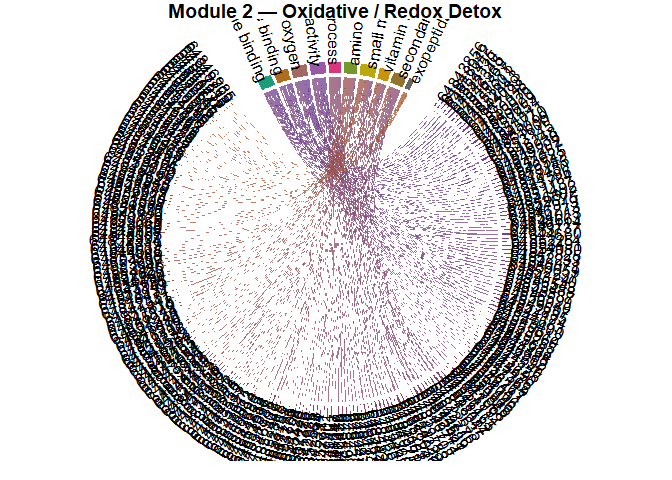<!-- -->

``` r
plot_chord(mod3, "Module 3 — Fatty Acid / Organic Acid Biosynthesis")
```

    ## Note: 1 point is out of plotting region in sector '64852805', track
    ## '1'.
    ## Note: 1 point is out of plotting region in sector '64852805', track
    ## '1'.
    ## Note: 1 point is out of plotting region in sector '64847541', track
    ## '1'.
    ## Note: 1 point is out of plotting region in sector '64847541', track
    ## '1'.
    ## Note: 1 point is out of plotting region in sector '64842351', track
    ## '1'.
    ## Note: 1 point is out of plotting region in sector '64842351', track
    ## '1'.
    ## Note: 1 point is out of plotting region in sector '64848047', track
    ## '1'.
    ## Note: 1 point is out of plotting region in sector '64848047', track
    ## '1'.
    ## Note: 1 point is out of plotting region in sector '64842276', track
    ## '1'.
    ## Note: 1 point is out of plotting region in sector '64842276', track
    ## '1'.
    ## Note: 1 point is out of plotting region in sector '64844689', track
    ## '1'.
    ## Note: 1 point is out of plotting region in sector '64844689', track
    ## '1'.
    ## Note: 1 point is out of plotting region in sector '64853708', track
    ## '1'.
    ## Note: 1 point is out of plotting region in sector '64853708', track
    ## '1'.
    ## Note: 1 point is out of plotting region in sector '64849753', track
    ## '1'.
    ## Note: 1 point is out of plotting region in sector '64849753', track
    ## '1'.
    ## Note: 1 point is out of plotting region in sector '64851149', track
    ## '1'.
    ## Note: 1 point is out of plotting region in sector '64851149', track
    ## '1'.
    ## Note: 1 point is out of plotting region in sector '64849584', track
    ## '1'.
    ## Note: 1 point is out of plotting region in sector '64849584', track
    ## '1'.
    ## Note: 1 point is out of plotting region in sector '64847013', track
    ## '1'.
    ## Note: 1 point is out of plotting region in sector '64847013', track
    ## '1'.
    ## Note: 1 point is out of plotting region in sector '64852241', track
    ## '1'.
    ## Note: 1 point is out of plotting region in sector '64852241', track
    ## '1'.
    ## Note: 1 point is out of plotting region in sector '64853427', track
    ## '1'.
    ## Note: 1 point is out of plotting region in sector '64853427', track
    ## '1'.
    ## Note: 1 point is out of plotting region in sector '64845341', track
    ## '1'.
    ## Note: 1 point is out of plotting region in sector '64845341', track
    ## '1'.
    ## Note: 1 point is out of plotting region in sector '64854480', track
    ## '1'.
    ## Note: 1 point is out of plotting region in sector '64854480', track
    ## '1'.
    ## Note: 1 point is out of plotting region in sector '64847357', track
    ## '1'.
    ## Note: 1 point is out of plotting region in sector '64847357', track
    ## '1'.
    ## Note: 1 point is out of plotting region in sector '64848902', track
    ## '1'.
    ## Note: 1 point is out of plotting region in sector '64848902', track
    ## '1'.
    ## Note: 1 point is out of plotting region in sector '64846542', track
    ## '1'.
    ## Note: 1 point is out of plotting region in sector '64846542', track
    ## '1'.
    ## Note: 1 point is out of plotting region in sector '64854424', track
    ## '1'.
    ## Note: 1 point is out of plotting region in sector '64854424', track
    ## '1'.
    ## Note: 1 point is out of plotting region in sector '64853962', track
    ## '1'.
    ## Note: 1 point is out of plotting region in sector '64853962', track
    ## '1'.
    ## Note: 1 point is out of plotting region in sector '64847958', track
    ## '1'.
    ## Note: 1 point is out of plotting region in sector '64847958', track
    ## '1'.
    ## Note: 1 point is out of plotting region in sector '64846544', track
    ## '1'.
    ## Note: 1 point is out of plotting region in sector '64846544', track
    ## '1'.
    ## Note: 1 point is out of plotting region in sector '64854425', track
    ## '1'.
    ## Note: 1 point is out of plotting region in sector '64854425', track
    ## '1'.
    ## Note: 1 point is out of plotting region in sector '64853546', track
    ## '1'.
    ## Note: 1 point is out of plotting region in sector '64853546', track
    ## '1'.
    ## Note: 1 point is out of plotting region in sector '64850139', track
    ## '1'.
    ## Note: 1 point is out of plotting region in sector '64850139', track
    ## '1'.
    ## Note: 1 point is out of plotting region in sector '64846556', track
    ## '1'.
    ## Note: 1 point is out of plotting region in sector '64846556', track
    ## '1'.
    ## Note: 1 point is out of plotting region in sector '64854230', track
    ## '1'.
    ## Note: 1 point is out of plotting region in sector '64854230', track
    ## '1'.
    ## Note: 1 point is out of plotting region in sector '64847188', track
    ## '1'.
    ## Note: 1 point is out of plotting region in sector '64847188', track
    ## '1'.
    ## Note: 1 point is out of plotting region in sector '64844254', track
    ## '1'.
    ## Note: 1 point is out of plotting region in sector '64844254', track
    ## '1'.
    ## Note: 1 point is out of plotting region in sector '64849749', track
    ## '1'.
    ## Note: 1 point is out of plotting region in sector '64849749', track
    ## '1'.
    ## Note: 1 point is out of plotting region in sector '64844585', track
    ## '1'.
    ## Note: 1 point is out of plotting region in sector '64844585', track
    ## '1'.
    ## Note: 1 point is out of plotting region in sector '64843571', track
    ## '1'.
    ## Note: 1 point is out of plotting region in sector '64843571', track
    ## '1'.
    ## Note: 1 point is out of plotting region in sector '64854380', track
    ## '1'.
    ## Note: 1 point is out of plotting region in sector '64854380', track
    ## '1'.
    ## Note: 1 point is out of plotting region in sector '64844816', track
    ## '1'.
    ## Note: 1 point is out of plotting region in sector '64844816', track
    ## '1'.
    ## Note: 1 point is out of plotting region in sector '64852255', track
    ## '1'.
    ## Note: 1 point is out of plotting region in sector '64852255', track
    ## '1'.
    ## Note: 1 point is out of plotting region in sector '64846435', track
    ## '1'.
    ## Note: 1 point is out of plotting region in sector '64846435', track
    ## '1'.
    ## Note: 1 point is out of plotting region in sector '64850702', track
    ## '1'.
    ## Note: 1 point is out of plotting region in sector '64850702', track
    ## '1'.
    ## Note: 1 point is out of plotting region in sector '64844595', track
    ## '1'.
    ## Note: 1 point is out of plotting region in sector '64844595', track
    ## '1'.
    ## Note: 1 point is out of plotting region in sector '64851647', track
    ## '1'.
    ## Note: 1 point is out of plotting region in sector '64851647', track
    ## '1'.
    ## Note: 1 point is out of plotting region in sector '64849401', track
    ## '1'.
    ## Note: 1 point is out of plotting region in sector '64849401', track
    ## '1'.
    ## Note: 1 point is out of plotting region in sector '64847901', track
    ## '1'.
    ## Note: 1 point is out of plotting region in sector '64847901', track
    ## '1'.
    ## Note: 1 point is out of plotting region in sector '64845849', track
    ## '1'.
    ## Note: 1 point is out of plotting region in sector '64845849', track
    ## '1'.
    ## Note: 1 point is out of plotting region in sector '64849265', track
    ## '1'.
    ## Note: 1 point is out of plotting region in sector '64849265', track
    ## '1'.
    ## Note: 1 point is out of plotting region in sector '64847170', track
    ## '1'.
    ## Note: 1 point is out of plotting region in sector '64847170', track
    ## '1'.
    ## Note: 1 point is out of plotting region in sector '64848037', track
    ## '1'.
    ## Note: 1 point is out of plotting region in sector '64848037', track
    ## '1'.
    ## Note: 1 point is out of plotting region in sector '64851618', track
    ## '1'.
    ## Note: 1 point is out of plotting region in sector '64851618', track
    ## '1'.
    ## Note: 1 point is out of plotting region in sector '64852228', track
    ## '1'.
    ## Note: 1 point is out of plotting region in sector '64852228', track
    ## '1'.
    ## Note: 1 point is out of plotting region in sector '64848219', track
    ## '1'.
    ## Note: 1 point is out of plotting region in sector '64848219', track
    ## '1'.
    ## Note: 1 point is out of plotting region in sector '64843129', track
    ## '1'.
    ## Note: 1 point is out of plotting region in sector '64843129', track
    ## '1'.
    ## Note: 1 point is out of plotting region in sector '64848060', track
    ## '1'.
    ## Note: 1 point is out of plotting region in sector '64848060', track
    ## '1'.
    ## Note: 1 point is out of plotting region in sector '64853652', track
    ## '1'.
    ## Note: 1 point is out of plotting region in sector '64853652', track
    ## '1'.
    ## Note: 1 point is out of plotting region in sector '64854228', track
    ## '1'.
    ## Note: 1 point is out of plotting region in sector '64854228', track
    ## '1'.
    ## Note: 1 point is out of plotting region in sector '64846370', track
    ## '1'.
    ## Note: 1 point is out of plotting region in sector '64846370', track
    ## '1'.
    ## Note: 1 point is out of plotting region in sector '64851482', track
    ## '1'.
    ## Note: 1 point is out of plotting region in sector '64851482', track
    ## '1'.
    ## Note: 1 point is out of plotting region in sector '64851598', track
    ## '1'.
    ## Note: 1 point is out of plotting region in sector '64851598', track
    ## '1'.
    ## Note: 1 point is out of plotting region in sector '64853635', track
    ## '1'.
    ## Note: 1 point is out of plotting region in sector '64853635', track
    ## '1'.
    ## Note: 1 point is out of plotting region in sector '64854419', track
    ## '1'.
    ## Note: 1 point is out of plotting region in sector '64854419', track
    ## '1'.
    ## Note: 1 point is out of plotting region in sector '64852441', track
    ## '1'.
    ## Note: 1 point is out of plotting region in sector '64852441', track
    ## '1'.
    ## Note: 1 point is out of plotting region in sector '64851884', track
    ## '1'.
    ## Note: 1 point is out of plotting region in sector '64851884', track
    ## '1'.
    ## Note: 1 point is out of plotting region in sector '64853603', track
    ## '1'.
    ## Note: 1 point is out of plotting region in sector '64853603', track
    ## '1'.
    ## Note: 1 point is out of plotting region in sector '64849266', track
    ## '1'.
    ## Note: 1 point is out of plotting region in sector '64849266', track
    ## '1'.
    ## Note: 1 point is out of plotting region in sector '64852252', track
    ## '1'.
    ## Note: 1 point is out of plotting region in sector '64852252', track
    ## '1'.
    ## Note: 1 point is out of plotting region in sector '64843394', track
    ## '1'.
    ## Note: 1 point is out of plotting region in sector '64843394', track
    ## '1'.
    ## Note: 1 point is out of plotting region in sector '64852538', track
    ## '1'.
    ## Note: 1 point is out of plotting region in sector '64852538', track
    ## '1'.
    ## Note: 1 point is out of plotting region in sector '64853709', track
    ## '1'.
    ## Note: 1 point is out of plotting region in sector '64853709', track
    ## '1'.
    ## Note: 1 point is out of plotting region in sector '64853755', track
    ## '1'.
    ## Note: 1 point is out of plotting region in sector '64853755', track
    ## '1'.
    ## Note: 1 point is out of plotting region in sector '64849105', track
    ## '1'.
    ## Note: 1 point is out of plotting region in sector '64849105', track
    ## '1'.
    ## Note: 1 point is out of plotting region in sector '64846985', track
    ## '1'.
    ## Note: 1 point is out of plotting region in sector '64846985', track
    ## '1'.
    ## Note: 1 point is out of plotting region in sector '64847563', track
    ## '1'.
    ## Note: 1 point is out of plotting region in sector '64847563', track
    ## '1'.
    ## Note: 1 point is out of plotting region in sector '64846891', track
    ## '1'.
    ## Note: 1 point is out of plotting region in sector '64846891', track
    ## '1'.
    ## Note: 1 point is out of plotting region in sector '64846474', track
    ## '1'.
    ## Note: 1 point is out of plotting region in sector '64846474', track
    ## '1'.
    ## Note: 1 point is out of plotting region in sector '64848931', track
    ## '1'.
    ## Note: 1 point is out of plotting region in sector '64848931', track
    ## '1'.
    ## Note: 1 point is out of plotting region in sector '64843955', track
    ## '1'.
    ## Note: 1 point is out of plotting region in sector '64843955', track
    ## '1'.
    ## Note: 1 point is out of plotting region in sector '64845202', track
    ## '1'.
    ## Note: 1 point is out of plotting region in sector '64845202', track
    ## '1'.
    ## Note: 1 point is out of plotting region in sector '64844690', track
    ## '1'.
    ## Note: 1 point is out of plotting region in sector '64844690', track
    ## '1'.
    ## Note: 1 point is out of plotting region in sector '64845520', track
    ## '1'.
    ## Note: 1 point is out of plotting region in sector '64845520', track
    ## '1'.
    ## Note: 1 point is out of plotting region in sector '64852629', track
    ## '1'.
    ## Note: 1 point is out of plotting region in sector '64852629', track
    ## '1'.
    ## Note: 1 point is out of plotting region in sector '64853637', track
    ## '1'.
    ## Note: 1 point is out of plotting region in sector '64853637', track
    ## '1'.
    ## Note: 1 point is out of plotting region in sector '64853988', track
    ## '1'.
    ## Note: 1 point is out of plotting region in sector '64853988', track
    ## '1'.
    ## Note: 1 point is out of plotting region in sector '64854006', track
    ## '1'.
    ## Note: 1 point is out of plotting region in sector '64854006', track
    ## '1'.
    ## Note: 1 point is out of plotting region in sector '64852334', track
    ## '1'.
    ## Note: 1 point is out of plotting region in sector '64852334', track
    ## '1'.
    ## Note: 1 point is out of plotting region in sector '64848307', track
    ## '1'.
    ## Note: 1 point is out of plotting region in sector '64848307', track
    ## '1'.
    ## Note: 1 point is out of plotting region in sector '64848005', track
    ## '1'.
    ## Note: 1 point is out of plotting region in sector '64848005', track
    ## '1'.
    ## Note: 1 point is out of plotting region in sector '64850138', track
    ## '1'.
    ## Note: 1 point is out of plotting region in sector '64850138', track
    ## '1'.
    ## Note: 1 point is out of plotting region in sector '64845820', track
    ## '1'.
    ## Note: 1 point is out of plotting region in sector '64845820', track
    ## '1'.
    ## Note: 1 point is out of plotting region in sector '64851640', track
    ## '1'.
    ## Note: 1 point is out of plotting region in sector '64851640', track
    ## '1'.
    ## Note: 1 point is out of plotting region in sector 'organic acid
    ## biosynthetic process', track '1'.
    ## Note: 1 point is out of plotting region in sector 'organic acid
    ## biosynthetic process', track '1'.
    ## Note: 1 point is out of plotting region in sector 'carboxylic acid
    ## biosynthetic process', track '1'.
    ## Note: 1 point is out of plotting region in sector 'carboxylic acid
    ## biosynthetic process', track '1'.
    ## Note: 1 point is out of plotting region in sector 'fatty acid
    ## biosynthetic process', track '1'.
    ## Note: 1 point is out of plotting region in sector 'fatty acid
    ## biosynthetic process', track '1'.
    ## Note: 1 point is out of plotting region in sector 'fatty acid synthase
    ## activity', track '1'.
    ## Note: 1 point is out of plotting region in sector 'fatty acid synthase
    ## activity', track '1'.
    ## Note: 1 point is out of plotting region in sector 'monocarboxylic acid
    ## biosynthetic process', track '1'.
    ## Note: 1 point is out of plotting region in sector 'monocarboxylic acid
    ## biosynthetic process', track '1'.
    ## Note: 1 point is out of plotting region in sector 'amide binding',
    ## track '1'.
    ## Note: 1 point is out of plotting region in sector 'amide binding',
    ## track '1'.
    ## Note: 1 point is out of plotting region in sector 'phosphopantetheine
    ## binding', track '1'.
    ## Note: 1 point is out of plotting region in sector 'phosphopantetheine
    ## binding', track '1'.
    ## Note: 1 point is out of plotting region in sector 'modified amino acid
    ## binding', track '1'.
    ## Note: 1 point is out of plotting region in sector 'modified amino acid
    ## binding', track '1'.
    ## Note: 1 point is out of plotting region in sector 'small molecule
    ## biosynthetic process', track '1'.
    ## Note: 1 point is out of plotting region in sector 'small molecule
    ## biosynthetic process', track '1'.
    ## Note: 1 point is out of plotting region in sector
    ## '3-oxoacyl-[acyl-carrier-protein] synthase activity', track '1'.
    ## Note: 1 point is out of plotting region in sector
    ## '3-oxoacyl-[acyl-carrier-protein] synthase activity', track '1'.

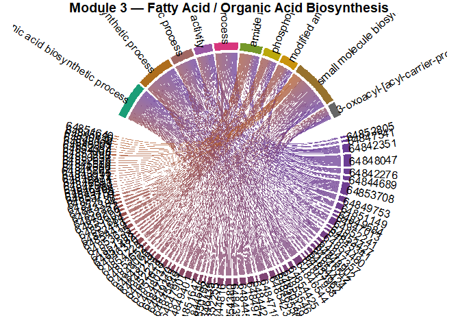<!-- -->

``` r
#could change to a bar graph

gsea_mod %>%
  count(module, Description, name = "n_genes") %>%
  ggplot(aes(x = reorder(Description, n_genes), y = n_genes, fill = module)) +
  geom_col() +
  coord_flip() +
  labs(x = "GO Term", y = "Number of Core Enrichment Genes") +
  theme_bw()
```

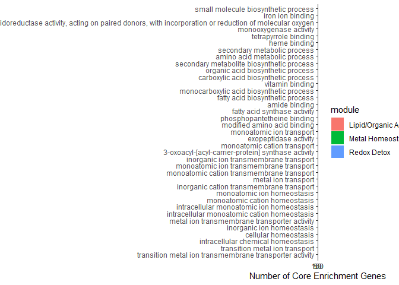<!-- -->

Take the data from above and make it into a barplot without module
separation

``` r
# count genes per GO term, keeping ontology
genes_per_term <- gsea_long %>%
  group_by(ONTOLOGY, Description) %>%
  summarise(n_genes = n_distinct(core_genes), .groups = "drop") %>%
  arrange(ONTOLOGY, desc(n_genes))

# plot with facet labels on the right
ggplot(genes_per_term,
       aes(x = reorder(Description, n_genes),
           y = n_genes,
           fill = ONTOLOGY)) +
  geom_col() +
  coord_flip() +
  facet_grid(
    ONTOLOGY ~ ., 
    scales = "free_y",
    switch = "y"        # moves facet labels to the right
  ) +
  scale_fill_manual(values = c(
    BP = "#1b9e77",
    MF = "#d95f02",
    CC = "#7570b3"
  )) +
  labs(
    x = "GO Term",
    y = "Number of Core Enrichment Genes",
    title = "Core Enrichment Gene Count per GO Term"
  ) +
  theme_bw(base_size = 12) +
  theme(
    legend.position = "none",
    strip.placement = "outside",
    strip.text.y.right = element_text(angle = 0)  # keeps labels horizontal
  )
```

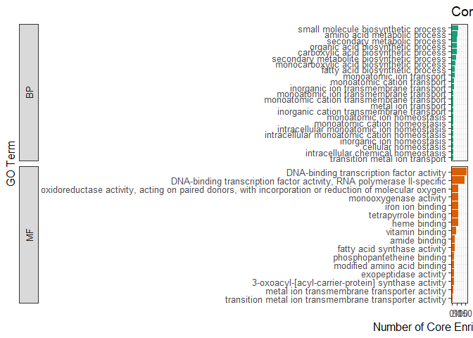<!-- -->

Now we are going to look at the genes differentially expressed only
during degradation.

``` r
mnday4_de <- read_table(file="deseq2_shrink_results_redowithbatch_trimsamples_mnonly_day4_combined.txt")
```

    ## 
    ## ── Column specification ────────────────────────────────────────────────────────
    ## cols(
    ##   annotation = col_character(),
    ##   baseMean = col_double(),
    ##   log2FoldChange = col_double(),
    ##   lfcSE = col_double(),
    ##   pvalue = col_double(),
    ##   padj = col_double()
    ## )

``` r
mnday7_de <- read_table(file="deseq2_shrink_results_redowithbatch_trimsamples_mnonly_day7_combined.txt")
```

    ## 
    ## ── Column specification ────────────────────────────────────────────────────────
    ## cols(
    ##   annotation = col_character(),
    ##   baseMean = col_double(),
    ##   log2FoldChange = col_double(),
    ##   lfcSE = col_double(),
    ##   pvalue = col_double(),
    ##   padj = col_double()
    ## )

``` r
nomnday4_de <- read_table(file="deseq2_shrink_results_redowithbatch_trimsamples_nomn_day4_combined.txt")
```

    ## 
    ## ── Column specification ────────────────────────────────────────────────────────
    ## cols(
    ##   annotation = col_character(),
    ##   baseMean = col_double(),
    ##   log2FoldChange = col_double(),
    ##   lfcSE = col_double(),
    ##   pvalue = col_double(),
    ##   padj = col_double()
    ## )

``` r
mnday4_de_sig <- mnday4_de[which(mnday4_de$padj<0.05),]
mnday7_de_sig <- mnday7_de[which(mnday7_de$padj<0.05),]
nomnday4_de_sig <- nomnday4_de[which(nomnday4_de$padj<0.05),]


which(mnday4_de_sig$annotation %in% mnday7_de_sig$annotation)
```

    ##  [1]   1   2   3   4   5   6   7   8   9  10  11  13  14  15  16  17  21  27  40
    ## [20]  41  49  66  85 133 156 158 171 189 258 365

``` r
#30

#remove the ones in both
mnday4_de_sig_nomn7 <- mnday4_de_sig[-(which(mnday4_de_sig$annotation %in% mnday7_de_sig$annotation)),]

#now see if any of the de genes from day 4 nomn are in the remaining

which(mnday4_de_sig_nomn7$annotation %in% nomnday4_de_sig$annotation)
```

    ## [1]   1   2 465

``` r
#3

#now remove those
mnday4_de_sig_nomn7_nonomn4 <- mnday4_de_sig_nomn7[-(which(mnday4_de_sig_nomn7$annotation %in% nomnday4_de_sig$annotation)),]

#write.csv(mnday4_de_sig_nomn7_nonomn4, file="mnday4_de_sig_nomn7_nonomn4_569genes.csv")
```

No let’s do GO analysis on these remaining genes.

``` r
#rename so IDs match

mnday4_de_sig_nomn7_nonomn4_rename <- mutate(as_tibble(mnday4_de_sig_nomn7_nonomn4), seqID = mnday4_de_sig_nomn7_nonomn4$annotation)

#join
mnday4_de_sig_nomn7_nonomn4_rename_join <- left_join(mnday4_de_sig_nomn7_nonomn4_rename,Aflavus_geneIDs, by="seqID")


genes_to_test_day4_unique <- as.character(mnday4_de_sig_nomn7_nonomn4_rename_join$GeneID)

#see if the geneIDs are in the database
length(which(!(genes_to_test_day4_unique %in% keys(org.Aflavus.eg.db))))
```

    ## [1] 0

``` r
#0 not in the database
length(which((genes_to_test_day4_unique %in% keys(org.Aflavus.eg.db))))
```

    ## [1] 569

``` r
#569 in the database

#now do the GO analysis

GO_results_day4_unique_MF <- enrichGO(gene = genes_to_test_day4_unique, OrgDb = org.Aflavus.eg.db, keyType = "ENTREZID", ont="MF", universe=all_genes)

GO_results_day4_unique_CC <- enrichGO(gene = genes_to_test_day4_unique, OrgDb = org.Aflavus.eg.db, keyType = "ENTREZID", ont="CC", universe=all_genes)

GO_results_day4_unique_BP <- enrichGO(gene = genes_to_test_day4_unique, OrgDb = org.Aflavus.eg.db, keyType = "ENTREZID", ont="BP", universe=all_genes)

#plot
dotplot(GO_results_day4_unique_MF, showCategory = 20)
```

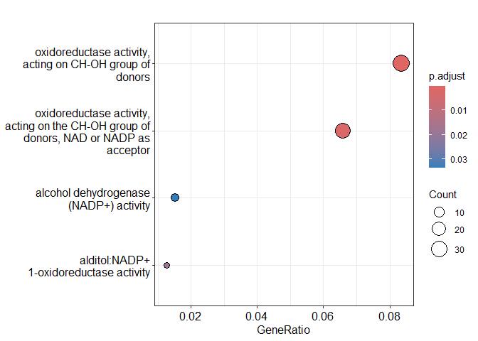<!-- -->

``` r
dotplot(GO_results_day4_unique_CC, showCategory = 20)
```

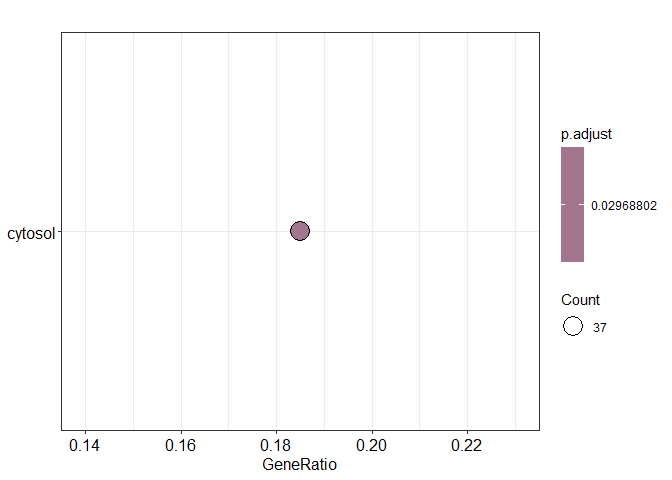<!-- -->

``` r
#dotplot(GO_results_day4_unique_BP, showCategory = 20)

#write.csv(mnday4_de_sig_nomn7_nonomn4_rename_join, file="mnday4_de_sig_nomn7_nonomn4_567genes_withAflavusIDs.csv")
```

Now let’s see what the volcano plot looks like with only the 569 genes
DE on

``` r
trim7 <- which(mnday4_de$annotation%in%mnday7_de_sig$annotation)

mnday4_only_de <- mnday4_de[-trim7,]

trim4nomn <- which(mnday4_only_de$annotation%in%nomnday4_de_sig$annotation)

mnday4_only_de <- mnday4_only_de[-trim4nomn,]

# Example: using shrunken results
df_4mno <- as.data.frame(mnday4_only_de)

# Add significance categories
df_4mno <- df_4mno %>%
  mutate(
    neglogp = -log10(padj),
    sig = case_when(
      padj < 0.05 & log2FoldChange > .75  ~ "Up",
      padj < 0.05 & log2FoldChange < -.75 ~ "Down",
      TRUE                              ~ "NS"
    )
  )

# Basic volcano plot
ggplot(df_4mno, aes(x = log2FoldChange, y = neglogp)) +
  geom_point(aes(color = sig), alpha = 0.7, size = 2) +
  scale_color_manual(
    values = c("Up" = "#D55E00", "Down" = "#0072B2", "NS" = "grey70")
  ) +
  geom_vline(xintercept = c(-.75, .75), linetype = "dashed", color = "grey40") +
  geom_hline(yintercept = -log10(0.05), linetype = "dashed", color = "grey40") +
  labs(
    x = "Log2 Fold Change (shrunken)",
    y = "-log10(adjusted p-value)",
    color = "Direction",
    title = "Volcano Plot: AFB1 yes vs no (Mn+ Day 4)"
  ) +
  theme_bw(base_size = 14) +
  theme(
    plot.title = element_text(hjust = 0.5),
    legend.position = "right"
  )
```

    ## Warning: Removed 733 rows containing missing values or values outside the scale range
    ## (`geom_point()`).

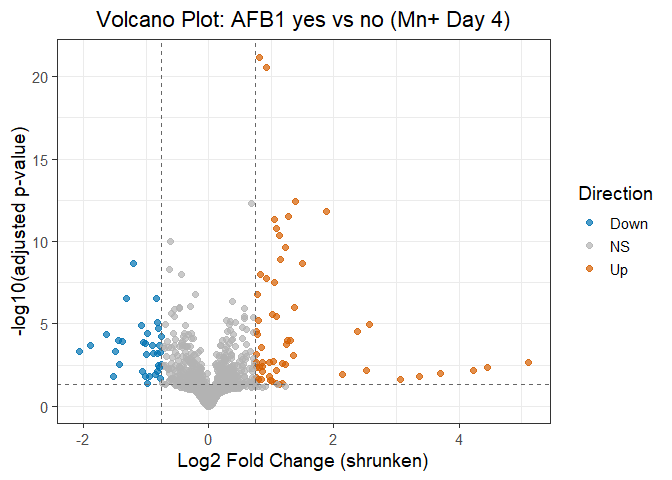<!-- -->

``` r
#add in gene labels
top_genes_4mno <- df_4mno %>%
  filter(padj < 0.05) %>%
  arrange(padj) %>%
  slice(1:4)

ggplot(df_4mno, aes(x = log2FoldChange, y = neglogp)) +
  geom_point(aes(color = sig), alpha = 0.7, size = 2) +
  geom_text_repel(
    data = top_genes_4mno,
    aes(label = top_genes_4mno$annotation),
    size = 3,
    max.overlaps = Inf
  ) +
  scale_color_manual(
    values = c("Up" = "#D55E00", "Down" = "#0072B2", "NS" = "grey70")
  ) +
  geom_vline(xintercept = c(-1, 1), linetype = "dashed", color = "grey40") +
  geom_hline(yintercept = -log10(0.05), linetype = "dashed", color = "grey40") +
  theme_bw(base_size = 14)
```

    ## Warning: Use of `top_genes_4mno$annotation` is discouraged.
    ## ℹ Use `annotation` instead.
    ## Removed 733 rows containing missing values or values outside the scale range
    ## (`geom_point()`).

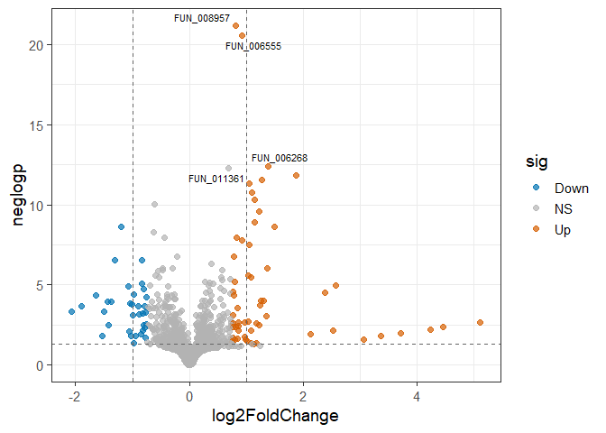<!-- -->

Let’s try that again but only with the up regulated DE genes above
log2FC=1

``` r
mnday4_de_sig_nomn7_nonomn4_rename_join_l2fc1 <- mnday4_de_sig_nomn7_nonomn4_rename_join[which(mnday4_de_sig_nomn7_nonomn4_rename_join$log2FoldChange > 0),]

genes_to_test_day4_unique_l2fc1 <- as.character(mnday4_de_sig_nomn7_nonomn4_rename_join_l2fc1$GeneID)

length(genes_to_test_day4_unique_l2fc1)
```

    ## [1] 284

``` r
#284

#now do the GO analysis

GO_results_day4_unique_l2fc1_MF <- enrichGO(gene = genes_to_test_day4_unique_l2fc1, OrgDb = org.Aflavus.eg.db, keyType = "ENTREZID", ont="MF", universe=all_genes)

GO_results_day4_unique_l2fc1_CC <- enrichGO(gene = genes_to_test_day4_unique_l2fc1, OrgDb = org.Aflavus.eg.db, keyType = "ENTREZID", ont="CC", universe=all_genes)

GO_results_day4_unique_l2fc1_BP <- enrichGO(gene = genes_to_test_day4_unique_l2fc1, OrgDb = org.Aflavus.eg.db, keyType = "ENTREZID", ont="BP", universe=all_genes)


#plot
dotplot(GO_results_day4_unique_l2fc1_MF, showCategory = 20)
```

<!-- -->

``` r
#dotplot(GO_results_day4_unique_l2fc1_CC, showCategory = 20)
dotplot(GO_results_day4_unique_l2fc1_BP, showCategory = 20)
```

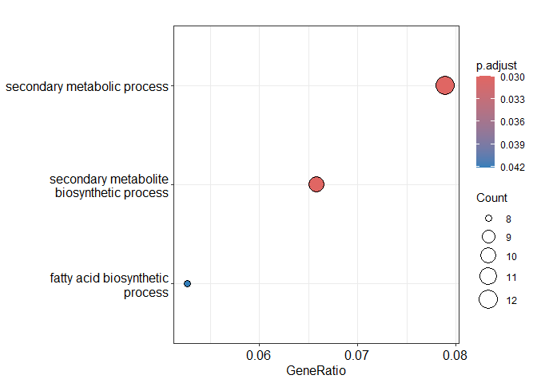<!-- -->
